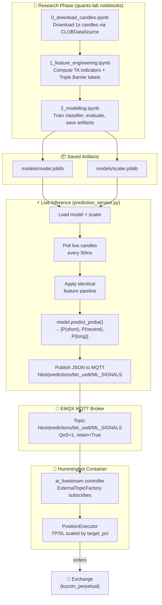
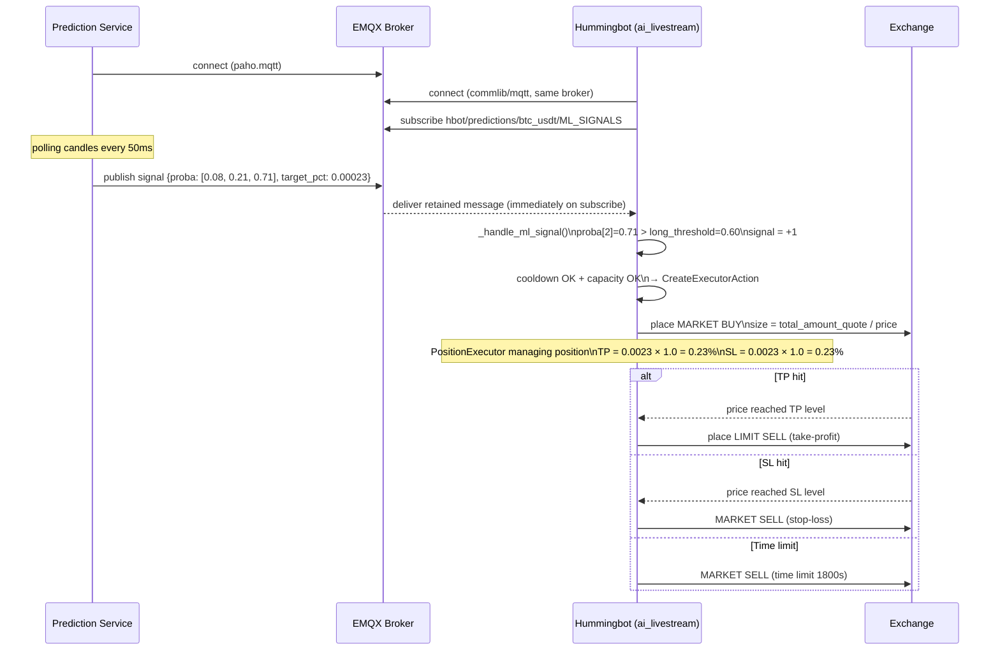

# AI Livestream: Training, Testing & Deploying an ML Trading Model

This guide walks through the complete lifecycle of building a machine learning model that drives the `ai_livestream` hummingbot controller — from downloading raw candle data to running a live inference service that publishes signals via MQTT to a deployed trading bot.

---

## Table of Contents

1. [System Overview](#1-system-overview)
2. [Prerequisites](#2-prerequisites)
3. [Step 1 — Data Collection](#3-step-1--data-collection)
4. [Step 2 — Feature Engineering](#4-step-2--feature-engineering)
5. [Step 3 — Triple Barrier Labeling](#5-step-3--triple-barrier-labeling)
6. [Step 4 — Data Preprocessing](#6-step-4--data-preprocessing)
7. [Step 5 — Model Training](#7-step-5--model-training)
8. [Step 6 — Model Evaluation](#8-step-6--model-evaluation)
9. [Step 7 — Offline Signal Simulation (Pseudo-Backtest)](#9-step-7--offline-signal-simulation-pseudo-backtest)
10. [Step 8 — Building the Prediction Service](#10-step-8--building-the-prediction-service)
11. [Step 9 — Deploying the Bot](#11-step-9--deploying-the-bot)
12. [Step 10 — Monitoring Live Signals](#12-step-10--monitoring-live-signals)
13. [Step 11 — Retraining & Iteration](#13-step-11--retraining--iteration)
14. [Design Alternatives & Extensions](#14-design-alternatives--extensions)

---

## 1. System Overview

The `ai_livestream` controller separates **signal generation** (your ML model) from **trade execution** (hummingbot). They communicate through the EMQX MQTT broker. This means:

- You can train, iterate, and replace your model without touching the bot
- The bot always receives the same JSON payload — it doesn't care what produced it
- You can run multiple models for different pairs or timeframes simultaneously



### What the MQTT Payload Looks Like

Every time your model runs inference, it publishes this JSON to the broker:

```json
{
  "id": 1710672000000,
  "trading_pair": "BTC-USDT",
  "probabilities": [0.08, 0.21, 0.71],
  "timestamp": "2026-03-17T10:00:00.000000",
  "target_pct": 0.00023
}
```

| Field | Type | Description |
|-------|------|-------------|
| `id` | int (ms) | Unix timestamp of prediction |
| `trading_pair` | str | The pair the model was run on |
| `probabilities` | list[float, float, float] | **[P(short), P(neutral), P(long)]** — order is critical |
| `timestamp` | ISO 8601 str | Human-readable prediction time |
| `target_pct` | float | Rolling volatility estimate — scales TP/SL distances |

The controller's decision rule:
- If `probabilities[0]` (short) > `short_threshold` → signal = **-1** (SELL)
- Else if `probabilities[2]` (long) > `long_threshold` → signal = **+1** (BUY)
- Else → signal = **0** (stay flat)

---

## 2. Prerequisites

### Python environment

```bash
# From quants-lab root
pip install pandas pandas_ta scikit-learn joblib optuna xgboost lightgbm
pip install paho-mqtt aiomqtt
pip install matplotlib seaborn  # for evaluation plots
```

### Services running

| Service | Where | Port | Purpose |
|---------|-------|------|---------|
| EMQX broker | hummingbot-api docker-compose | 1883 | MQTT message bus |
| Exchange data feed | Binance / KuCoin API | — | Live candle data for inference |

### Verify MQTT connectivity

```python
import paho.mqtt.client as mqtt

client = mqtt.Client()
client.connect("localhost", 1883, 60)
client.publish("test/ping", "hello", qos=1)
client.disconnect()
print("MQTT broker reachable")
```

If the broker requires auth (check `.env` for `BROKER_USERNAME`/`BROKER_PASSWORD`):

```python
client.username_pw_set("admin", "password")
```

---

## 3. Step 1 — Data Collection

### Why 1-second candles?

The reference implementation uses `interval="1s"` because:
- The triple barrier time-limit (`tl=300` seconds) needs fine-grained data to accurately label which barrier was hit first
- The prediction service publishes every 50ms — at coarser intervals you'd generate the same signal many times per bar
- Short-term microstructure features (volume imbalance, fast MA crossings) are only visible at sub-minute resolution

### Download candles via CLOBDataSource

```python
# research_notebooks/eda_strategies/ai_livestream/0_download_candles.ipynb

import asyncio
from core.data_sources.clob import CLOBDataSource

CONNECTOR_NAME = "binance"          # use binance for data (not kucoin) — better 1s feed
TRADING_PAIR   = "BTC-USDT"
INTERVAL       = "1s"
DAYS           = 7                  # start with 7 days; 30 days is better for production

clob = CLOBDataSource()

async def download():
    candles = await clob.get_candles(
        connector_name=CONNECTOR_NAME,
        trading_pair=TRADING_PAIR,
        interval=INTERVAL,
        days=DAYS,
    )
    clob.dump_candles_cache(candles, connector_name=CONNECTOR_NAME,
                            trading_pair=TRADING_PAIR, interval=INTERVAL)
    print(f"Downloaded {len(candles):,} candles")
    return candles

candles_df = asyncio.run(download())
```

### What you get

Each row is one 1-second bar with these columns:

```
timestamp | open | high | low | close | volume | quote_asset_volume |
taker_buy_base_volume | taker_buy_quote_volume
```

### Data quality checks

```python
# Check for gaps (missing seconds)
ts = candles_df["timestamp"].sort_values()
gaps = ts.diff().dropna()
large_gaps = gaps[gaps > pd.Timedelta("2s")]
print(f"Gaps > 2s: {len(large_gaps)}")
print(large_gaps.head(10))

# Check for zero-volume bars (exchange was offline)
zero_vol = candles_df[candles_df["volume"] == 0]
print(f"Zero-volume bars: {len(zero_vol)} ({len(zero_vol)/len(candles_df)*100:.1f}%)")

# Minimum required bars
MIN_BARS = 500 * 200  # 500 bars warm-up × 200 for rolling std
print(f"Available: {len(candles_df):,}  |  Minimum recommended: {MIN_BARS:,}")
```

---

## 4. Step 2 — Feature Engineering

The feature engineering notebook computes technical indicators that will be the model's input. **The exact same pipeline must be applied both during training and during live inference** — any mismatch will silently degrade model performance.

### Features computed

```python
import pandas_ta as ta

def compute_features(df: pd.DataFrame) -> pd.DataFrame:
    """
    Compute all TA features. Must be identical in training AND inference.
    Returns DataFrame with original columns plus feature columns.
    """
    df = df.copy()

    # Bollinger Bands — two parameter sets for different time scales
    bb20  = ta.bbands(df["close"], length=20, std=2)
    bb50  = ta.bbands(df["close"], length=50, std=2)
    df = pd.concat([df, bb20, bb50], axis=1)

    # MACD — two parameter sets for different momentum windows
    macd1 = ta.macd(df["close"], fast=12, slow=26, signal=9)
    macd2 = ta.macd(df["close"], fast=8,  slow=21, signal=5)
    df = pd.concat([df, macd1, macd2], axis=1)

    # RSI — two lookbacks
    df["RSI_14"] = ta.rsi(df["close"], length=14)
    df["RSI_21"] = ta.rsi(df["close"], length=21)

    # Moving averages
    df["SMA_20"] = ta.sma(df["close"], length=20)
    df["SMA_50"] = ta.sma(df["close"], length=50)
    df["EMA_20"] = ta.ema(df["close"], length=20)
    df["EMA_50"] = ta.ema(df["close"], length=50)

    # Volatility and momentum
    df["ATRr_14"]       = ta.atr(df["high"], df["low"], df["close"], length=14)
    stoch               = ta.stoch(df["high"], df["low"], df["close"], k=14, d=3)
    df                  = pd.concat([df, stoch], axis=1)
    adx                 = ta.adx(df["high"], df["low"], df["close"], length=14)
    df                  = pd.concat([df, adx], axis=1)

    # Volatility target (used as target_pct in the MQTT payload)
    df["target"] = df["close"].rolling(200).std() / df["close"]

    return df
```

### What each feature captures

```
Feature group         Features                         What it measures
─────────────────────────────────────────────────────────────────────────
Bollinger Bands       BBP_20, BBP_50                   Price position within volatility envelope
                      BBB_20, BBB_50                   Band width (volatility level)
MACD                  MACD_12_26_9, MACDh, MACDs       Trend momentum (slow)
                      MACD_8_21_5,  MACDh, MACDs       Trend momentum (fast)
RSI                   RSI_14, RSI_21                   Overbought/oversold (mean reversion)
Moving Averages       SMA_20/50, EMA_20/50             Trend direction and strength
Volatility            ATRr_14                          Absolute volatility (position sizing proxy)
Stochastic            STOCHk_14, STOCHd_14             Short-term price oscillation
ADX                   ADX_14, DMP_14, DMN_14           Trend strength + directional components
Volume                buy_volume_ratio                  Buy pressure (taker buys / total volume)
Volatility target     target                           Rolling std / price → scales TP/SL
```

---

## 5. Step 3 — Triple Barrier Labeling

This is the most important step. The quality of your labels determines the ceiling on your model's performance.

### What triple barrier labeling does

For each bar, we ask: *"If I opened a long position at this bar's close, what would happen first — take-profit, stop-loss, or time-limit?"*

```
  Price
    │
    │  ──── TAKE PROFIT ─────────────────  close × (1 + tp × target)   → label = +1
    │                      /‾‾\
    │                     /    \___
    │  ── close (entry) ─/────────────────────────────────────────────
    │                               \_____
    │  ──── STOP LOSS ───────────────────────────────────────────────  close × (1 - sl × target)   → label = -1
    │
    └──────────────────────────────────────────────────────────────────► Time (seconds)
                                                        │
                                               time_limit (tl seconds)  → label = 0

  target  = rolling_std(close, std_span) / close    (normalized volatility)
  tp barrier  = close × (1 + tp_multiplier × target)
  sl barrier  = close × (1 - sl_multiplier × target)
  time barrier = tl seconds from entry bar
```

### Running the labeler

```python
from core.backtesting.triple_barrier_method import triple_barrier_method

df_labeled = triple_barrier_method(
    df       = df_with_features,
    tp       = 3.5,      # TP barrier = 3.5 × target (normalized volatility)
    sl       = 3.5,      # SL barrier = 3.5 × target (symmetric barriers)
    tl       = 300,      # time limit = 300 seconds (5 minutes)
    std_span = 200,      # rolling std lookback
    trade_cost = 0.0,    # set to 0 for labeling; account for cost in evaluation
)

# close_type column: +1 (TP hit), -1 (SL hit), 0 (time limit)
print(df_labeled["close_type"].value_counts())
```

### Choosing tp, sl, tl parameters — a practical guide

The parameters define what trades the model is trained to predict. Getting this right is crucial.

```
  Too tight (tp=sl=0.5, tl=30s):
  ┌─────────────────────────────────────────────────────────────────┐
  │  Most labels → 0 (time limit)                                  │
  │  Model learns "nothing usually happens in 30s" → useless       │
  └─────────────────────────────────────────────────────────────────┘

  Too loose (tp=sl=20, tl=86400s):
  ┌─────────────────────────────────────────────────────────────────┐
  │  Every label → ±1 (barriers always hit before time limit)      │
  │  But the "label" is just random noise over such a long window  │
  └─────────────────────────────────────────────────────────────────┘

  Sweet spot (tp=sl=3.5, tl=300s):
  ┌─────────────────────────────────────────────────────────────────┐
  │  Reasonable class distribution: ~30% long, ~30% short, ~40% flat│
  │  Tight enough that the label is meaningful signal               │
  │  Loose enough to allow enough positive examples for training    │
  └─────────────────────────────────────────────────────────────────┘
```

**Rule of thumb:** Start with `tp == sl` (symmetric barriers). Set `tl` to roughly 3–5× the average time between TP/SL hits. Check the label distribution — aim for roughly balanced ±1 classes.

### Check label distribution

```python
import matplotlib.pyplot as plt

label_counts = df_labeled["close_type"].value_counts().sort_index()

fig, axes = plt.subplots(1, 2, figsize=(12, 4))

# Bar chart
label_counts.plot(kind="bar", ax=axes[0], color=["#e74c3c", "#95a5a6", "#2ecc71"])
axes[0].set_xticklabels(["-1 (Short/SL)", "0 (Neutral/Time)", "+1 (Long/TP)"], rotation=0)
axes[0].set_title("Label Distribution")
axes[0].set_ylabel("Count")
for bar, count in zip(axes[0].patches, label_counts.values):
    axes[0].text(bar.get_x() + bar.get_width()/2, bar.get_height() + 100,
                 f"{count/len(df_labeled)*100:.1f}%", ha="center")

# Rolling label distribution over time (regime analysis)
df_labeled["close_type"].rolling(10000).apply(lambda x: (x==1).mean()).plot(
    ax=axes[1], label="P(long)", color="#2ecc71")
df_labeled["close_type"].rolling(10000).apply(lambda x: (x==-1).mean()).plot(
    ax=axes[1], label="P(short)", color="#e74c3c")
axes[1].set_title("Rolling Label Frequency (10k bar window)")
axes[1].legend()
axes[1].set_ylabel("Proportion")

plt.tight_layout()
plt.savefig("figures/label_distribution.png", dpi=150)
plt.show()
```

---

## 6. Step 4 — Data Preprocessing

**This pipeline must be applied identically in training and in the live prediction service.** Any difference — even column order — will cause silent mismatch.

### The preprocessing pipeline

```python
from sklearn.preprocessing import StandardScaler
import joblib

def preprocess(df: pd.DataFrame, scaler: StandardScaler = None, fit: bool = True):
    """
    Preprocess features. Set fit=True during training, fit=False during inference.

    IMPORTANT: This function must produce the exact same column set and transformation
    in training and inference. Any deviation causes silent prediction errors.
    """
    df = df.copy()

    # Step 1: Drop raw columns not used as features
    columns_to_drop = ["timestamp", "taker_buy_base_volume", "volume"]
    df = df.drop(columns=[c for c in columns_to_drop if c in df.columns])

    # Step 2: Convert OHLC to returns (stationarize price)
    for col in ["open", "high", "low", "close"]:
        if col in df.columns:
            df[f"{col}_ret"] = df[col].pct_change()
    df = df.drop(columns=["open", "high", "low", "close"])

    # Step 3: Volume ratio (buy pressure signal)
    if "taker_buy_quote_volume" in df.columns and "quote_asset_volume" in df.columns:
        df["buy_volume_ratio"] = df["taker_buy_quote_volume"] / df["quote_asset_volume"]
        df = df.drop(columns=["taker_buy_quote_volume", "quote_asset_volume"])

    # Step 4: Drop rows with NaN (from rolling indicators)
    df = df.dropna()

    # Step 5: Separate target from features
    target_col = "close_type"  # present during training, absent during inference
    has_target = target_col in df.columns
    target = None
    if has_target:
        target = df[target_col]
        df = df.drop(columns=[target_col])

    # Step 6: Also drop target from features if it leaked in
    #         (target_pct is a feature — do NOT drop it)
    feature_cols = [c for c in df.columns if c != target_col]
    df = df[feature_cols]

    # Step 7: Scale features
    if fit:
        scaler = StandardScaler()
        scaled = scaler.fit_transform(df)
        joblib.dump(scaler, "models/scaler.joblib")
    else:
        if scaler is None:
            raise ValueError("Must provide fitted scaler for inference")
        scaled = scaler.transform(df)

    df_scaled = pd.DataFrame(scaled, columns=feature_cols, index=df.index)

    return df_scaled, target, scaler
```

### Pipeline integrity test

Run this after writing the preprocessing function to verify it's stable:

```python
# Simulate training → inference mismatch detection
X_train, y_train, scaler = preprocess(df_train, fit=True)
X_infer, _,      _      = preprocess(df_test, scaler=scaler, fit=False)

# Columns must be identical and in the same order
assert list(X_train.columns) == list(X_infer.columns), \
    f"Column mismatch!\nTrain: {list(X_train.columns)}\nInfer: {list(X_infer.columns)}"

# Scaled means should be close to 0 (from StandardScaler fit)
print("Feature means (should be ~0):", X_train.mean().describe())
print("Feature stds (should be ~1):",  X_train.std().describe())
print(f"Train shape: {X_train.shape}  |  Infer shape: {X_infer.shape}")
print("Pipeline integrity check passed")
```

---

## 7. Step 5 — Model Training

### Class balancing

Crypto markets spend most of their time in a noisy, directionless state. The label distribution is naturally imbalanced. If you don't balance it, the model learns to predict `0` (neutral) for almost every bar and achieves high accuracy while generating no useful signals.

```python
import pandas as pd
import numpy as np

def balance_classes(X: pd.DataFrame, y: pd.Series, random_state=42) -> tuple:
    """
    Equal-size sampling of all three classes.
    Uses the smaller of the +1/-1 classes as the target size,
    then down-samples the neutral class to match.
    """
    # Count directional classes
    n_pos = (y ==  1).sum()
    n_neg = (y == -1).sum()
    target_size = min(n_pos, n_neg)

    # Sample equal portions of each class
    rng = np.random.RandomState(random_state)

    idx_pos = rng.choice(np.where(y ==  1)[0], size=target_size, replace=False)
    idx_neg = rng.choice(np.where(y == -1)[0], size=target_size, replace=False)
    idx_neu = rng.choice(np.where(y ==  0)[0], size=target_size, replace=False)

    idx_balanced = np.concatenate([idx_pos, idx_neg, idx_neu])
    rng.shuffle(idx_balanced)

    return X.iloc[idx_balanced], y.iloc[idx_balanced]
```

### Train/validation split — important nuance

**Do not shuffle randomly across the full dataset** — this causes look-ahead bias (training on future data, testing on past data gives falsely optimistic results).

```python
from sklearn.model_selection import TimeSeriesSplit

# Chronological split: train on first 70%, validate on next 15%, test on last 15%
n = len(X_scaled)
train_end = int(n * 0.70)
val_end   = int(n * 0.85)

X_train_raw, y_train_raw = X_scaled[:train_end], y[:train_end]
X_val,       y_val       = X_scaled[train_end:val_end], y[train_end:val_end]
X_test,      y_test      = X_scaled[val_end:],  y[val_end:]

# Balance only the training set (not val/test — you want realistic class proportions there)
X_train, y_train = balance_classes(X_train_raw, y_train_raw)

print(f"Train: {len(X_train):,}  |  Val: {len(X_val):,}  |  Test: {len(X_test):,}")
print(f"Train class distribution:\n{y_train.value_counts()}")
```

### Baseline: RandomForestClassifier

```python
from sklearn.ensemble import RandomForestClassifier
import joblib

model = RandomForestClassifier(
    n_estimators  = 500,      # more trees = more stable, slower to train
    max_depth     = 3,        # shallow trees reduce overfitting
    random_state  = 42,
    n_jobs        = -1,       # use all CPU cores
    class_weight  = "balanced",  # additional per-class weighting during training
)

model.fit(X_train, y_train)
joblib.dump(model, "models/model.joblib")

print("Model trained and saved.")
print(f"Feature count: {X_train.shape[1]}")
print(f"OOB score: {model.oob_score_:.4f}" if hasattr(model, "oob_score_") else "")
```

### Alternative models (drop-in replacements)

All of these produce `predict_proba()` with the same interface:

```python
# XGBoost (often better for tabular data)
import xgboost as xgb
model = xgb.XGBClassifier(
    n_estimators     = 300,
    max_depth        = 4,
    learning_rate    = 0.05,
    subsample        = 0.8,
    colsample_bytree = 0.8,
    scale_pos_weight = 1,
    eval_metric      = "mlogloss",
    random_state     = 42,
    n_jobs           = -1,
)

# LightGBM (fastest for large datasets)
import lightgbm as lgb
model = lgb.LGBMClassifier(
    n_estimators      = 500,
    max_depth         = 4,
    learning_rate     = 0.05,
    num_leaves        = 15,
    class_weight      = "balanced",
    random_state      = 42,
    n_jobs            = -1,
)

# CRITICAL: sklearn sorts class labels alphabetically/numerically
# For labels {-1, 0, 1}, classes_ = [-1, 0, 1]
# predict_proba() columns are [P(-1), P(0), P(1)] = [P(short), P(neutral), P(long)]
# This matches the ai_livestream controller's expected order.
print("Class order:", model.classes_)
```

---

## 8. Step 6 — Model Evaluation

### Core metrics

```python
from sklearn.metrics import (
    classification_report, confusion_matrix,
    log_loss, roc_auc_score, brier_score_loss
)
import matplotlib.pyplot as plt
import seaborn as sns

# Get predictions on test set
y_pred      = model.predict(X_test)
y_proba     = model.predict_proba(X_test)

# --- Classification report ---
labels = [-1, 0, 1]
label_names = ["Short (-1)", "Neutral (0)", "Long (+1)"]
print(classification_report(y_test, y_pred, target_names=label_names))

# --- Confusion matrix ---
cm = confusion_matrix(y_test, y_pred, labels=labels, normalize="true")
fig, ax = plt.subplots(figsize=(6, 5))
sns.heatmap(cm, annot=True, fmt=".2f", cmap="Blues",
            xticklabels=label_names, yticklabels=label_names, ax=ax)
ax.set_ylabel("True label")
ax.set_xlabel("Predicted label")
ax.set_title("Normalized Confusion Matrix (test set)")
plt.tight_layout()
plt.savefig("figures/confusion_matrix.png", dpi=150)
plt.show()

# --- Probability calibration ---
# Are predicted probabilities meaningful? P(long)=0.7 should win ~70% of the time.
from sklearn.calibration import calibration_curve

fig, ax = plt.subplots(figsize=(6, 5))
for i, (cls, name) in enumerate(zip(labels, label_names)):
    y_binary   = (y_test == cls).astype(int)
    prob_true, prob_pred = calibration_curve(y_binary, y_proba[:, i], n_bins=10)
    ax.plot(prob_pred, prob_true, marker="o", label=name)
ax.plot([0, 1], [0, 1], "k--", label="Perfect calibration")
ax.set_xlabel("Mean predicted probability")
ax.set_ylabel("Fraction of positives")
ax.set_title("Calibration Curves")
ax.legend()
plt.tight_layout()
plt.savefig("figures/calibration_curves.png", dpi=150)
plt.show()
```

### Probability threshold analysis

The `long_threshold` and `short_threshold` in the controller config control how confident the model must be before acting. Choosing them requires a precision/recall tradeoff:

```python
import numpy as np

thresholds = np.arange(0.4, 0.9, 0.05)

results = []
for thresh in thresholds:
    # Apply threshold: signal fires only when P(long) > thresh
    long_signals  = y_proba[:, 2] > thresh
    short_signals = y_proba[:, 0] > thresh

    # Precision: of the bars we signal long, what fraction was actually TP (+1)?
    long_precision  = (y_test[long_signals]  ==  1).mean() if long_signals.any()  else 0
    short_precision = (y_test[short_signals] == -1).mean() if short_signals.any() else 0

    # Coverage: what fraction of all +1 bars did we signal?
    long_recall  = long_signals[y_test ==  1].mean()
    short_recall = short_signals[y_test == -1].mean()

    # Signal frequency: how often does the model signal per bar?
    signal_freq = (long_signals | short_signals).mean()

    results.append({
        "threshold": thresh,
        "long_precision": long_precision, "short_precision": short_precision,
        "long_recall": long_recall,       "short_recall": short_recall,
        "signal_freq": signal_freq,
    })

results_df = pd.DataFrame(results)
print(results_df.to_string(index=False, float_format="{:.3f}".format))
```

**Example output — how to read it:**

```
threshold  long_prec  short_prec  long_recall  short_recall  signal_freq
  0.40       0.372      0.358       0.821        0.794         0.412
  0.50       0.401      0.389       0.692        0.671         0.281   ← default threshold
  0.60       0.438      0.424       0.521        0.503         0.167
  0.70       0.481      0.467       0.342        0.328         0.082
  0.80       0.532      0.511       0.187        0.171         0.038
  0.90       0.611      0.598       0.061        0.055         0.009

Higher threshold = higher precision but fewer signals.
A precision of 0.4 means 40% of signals lead to TP — that's
actually viable if TP > SL (asymmetric barriers).
```

### Feature importance

```python
import pandas as pd

importances = pd.Series(model.feature_importances_, index=X_train.columns)
importances = importances.sort_values(ascending=False)

fig, ax = plt.subplots(figsize=(10, 6))
importances.head(20).plot(kind="barh", ax=ax, color="#3498db")
ax.invert_yaxis()
ax.set_title("Top 20 Feature Importances (RandomForest)")
ax.set_xlabel("Importance score")
plt.tight_layout()
plt.savefig("figures/feature_importance.png", dpi=150)
plt.show()
```

---

## 9. Step 7 — Offline Signal Simulation (Pseudo-Backtest)

The `ai_livestream` controller cannot be directly plugged into `BacktestingEngine` — its `update_processed_data()` is a no-op that relies on live MQTT messages. Instead, simulate what the controller would have done on historical data using model predictions.

### Simulation approach

```python
import numpy as np

def simulate_trading(
    df: pd.DataFrame,          # original candle df (with close prices)
    y_proba: np.ndarray,       # model.predict_proba(X_test)
    y_labels: pd.Series,       # ground truth close_type from triple barrier
    long_threshold: float = 0.5,
    short_threshold: float = 0.5,
    cooldown_bars: int = 300,  # seconds = bars at 1s interval
    max_executors_per_side: int = 1,
    take_profit: float = 0.015,
    stop_loss: float = 0.015,
    trade_cost: float = 0.0006,
) -> pd.DataFrame:
    """
    Simulate ai_livestream controller decisions using offline model predictions.
    Returns a DataFrame with one row per executed trade.
    """
    trades = []
    last_long_bar  = -cooldown_bars - 1
    last_short_bar = -cooldown_bars - 1
    open_longs  = 0
    open_shorts = 0

    for i, (proba, label) in enumerate(zip(y_proba, y_labels)):
        p_short, p_neutral, p_long = proba

        # Determine signal (mirrors ai_livestream logic exactly)
        if p_short > short_threshold:
            signal = -1
        elif p_long > long_threshold:
            signal = 1
        else:
            signal = 0

        # Cooldown + capacity checks (mirrors can_create_executor)
        if signal == 1:
            can_enter = (
                open_longs < max_executors_per_side and
                (i - last_long_bar) > cooldown_bars
            )
        elif signal == -1:
            can_enter = (
                open_shorts < max_executors_per_side and
                (i - last_short_bar) > cooldown_bars
            )
        else:
            can_enter = False

        if can_enter:
            # Record trade outcome using the triple barrier label
            pnl_pct = 0.0
            if signal == 1:   # long
                if label ==  1: pnl_pct =  take_profit - trade_cost
                if label == -1: pnl_pct = -stop_loss   - trade_cost
                if label ==  0: pnl_pct =              - trade_cost
                last_long_bar = i
            elif signal == -1:  # short
                if label == -1: pnl_pct =  take_profit - trade_cost
                if label ==  1: pnl_pct = -stop_loss   - trade_cost
                if label ==  0: pnl_pct =              - trade_cost
                last_short_bar = i

            trades.append({
                "bar": i,
                "signal": signal,
                "p_long": p_long,
                "p_short": p_short,
                "label": label,
                "pnl_pct": pnl_pct,
            })

    trades_df = pd.DataFrame(trades)
    return trades_df


# Run simulation on test set
sim = simulate_trading(
    df             = candles_df.iloc[val_end:],
    y_proba        = y_proba,
    y_labels       = y_test,
    long_threshold = 0.60,    # experiment with thresholds here
    short_threshold = 0.60,
)

# Equity curve
sim["cumulative_pnl"] = sim["pnl_pct"].cumsum()

fig, axes = plt.subplots(2, 1, figsize=(12, 8))

# Equity curve
sim["cumulative_pnl"].plot(ax=axes[0], color="#2ecc71")
axes[0].axhline(0, color="gray", linewidth=0.5)
axes[0].set_title(f"Simulated Equity Curve (threshold={0.60})")
axes[0].set_ylabel("Cumulative PnL %")

# Trade distribution
sim["pnl_pct"].hist(ax=axes[1], bins=30, color="#3498db", edgecolor="white")
axes[1].axvline(0, color="red", linewidth=1)
axes[1].set_title("Trade PnL Distribution")
axes[1].set_xlabel("PnL %")

plt.tight_layout()
plt.savefig("figures/simulation_results.png", dpi=150)
plt.show()

# Performance summary
total_trades  = len(sim)
win_rate      = (sim["pnl_pct"] > 0).mean()
avg_pnl       = sim["pnl_pct"].mean()
total_pnl     = sim["pnl_pct"].sum()
sharpe        = sim["pnl_pct"].mean() / sim["pnl_pct"].std() * np.sqrt(252 * 24 * 3600)
max_drawdown  = (sim["cumulative_pnl"] - sim["cumulative_pnl"].cummax()).min()

print(f"""
Simulation Results (threshold={0.60})
─────────────────────────────────────
Total trades:    {total_trades:,}
Win rate:        {win_rate*100:.1f}%
Average PnL:     {avg_pnl*100:.4f}%
Total PnL:       {total_pnl*100:.2f}%
Sharpe (annlzd): {sharpe:.2f}
Max drawdown:    {max_drawdown*100:.2f}%
""")
```

### Interpreting simulation results

```
  ✅ Acceptable results:
     Win rate > 40%  (with symmetric TP/SL)
     Sharpe > 1.0 on test set
     Max drawdown < 10% of total PnL
     Total trades > 100 (enough to be statistically meaningful)

  ⚠️  Warning signs:
     Win rate ≈ 50% but total PnL negative → trade costs are eating alpha
     Very high win rate (>70%) with negative total PnL → TP << SL (asymmetric)
     Sharpe > 3.0 on test set → likely overfitting
     < 30 trades → not statistically meaningful

  ❌ Do not deploy:
     Negative cumulative PnL on test set
     Sharpe < 0.5
     Max drawdown > total PnL (model loses more than it gains)
```

### Walk-forward validation

For more robust evaluation, repeat the simulation across multiple time windows:

```python
from sklearn.model_selection import TimeSeriesSplit

tscv = TimeSeriesSplit(n_splits=5)
walk_forward_results = []

for fold, (train_idx, test_idx) in enumerate(tscv.split(X_scaled)):
    # Train
    X_tr, y_tr = balance_classes(X_scaled.iloc[train_idx], y.iloc[train_idx])
    model_fold = RandomForestClassifier(n_estimators=300, max_depth=3, random_state=42)
    model_fold.fit(X_tr, y_tr)

    # Test
    X_te, y_te = X_scaled.iloc[test_idx], y.iloc[test_idx]
    y_proba_fold = model_fold.predict_proba(X_te)

    sim_fold = simulate_trading(
        df=candles_df.iloc[test_idx], y_proba=y_proba_fold,
        y_labels=y_te, long_threshold=0.60, short_threshold=0.60,
    )
    total_pnl = sim_fold["pnl_pct"].sum()
    sharpe    = (sim_fold["pnl_pct"].mean() /
                 sim_fold["pnl_pct"].std() * np.sqrt(252*24*3600)
                 if len(sim_fold) > 1 else 0)
    walk_forward_results.append({"fold": fold, "total_pnl": total_pnl, "sharpe": sharpe, "trades": len(sim_fold)})

print(pd.DataFrame(walk_forward_results))
# If sharpe is consistently positive across folds → model has real edge
# If sharpe varies wildly → overfitting or insufficient data
```

---

## 10. Step 8 — Building the Prediction Service

The prediction service is a long-running process that:
1. Polls live candles from the exchange
2. Runs the same feature pipeline as training
3. Calls `model.predict_proba()` on the most recent bar
4. Publishes the result to EMQX via MQTT

### Full prediction service

```python
# prediction_service.py
# Run from quants-lab root: python prediction_service.py

import asyncio
import json
import time
import logging
import joblib
import numpy as np
import pandas as pd
import pandas_ta as ta
import paho.mqtt.client as mqtt

from hummingbot.data_feed.candles_feed.candles_factory import CandlesFactory, CandlesConfig

logging.basicConfig(level=logging.INFO, format="%(asctime)s %(levelname)s %(message)s")
log = logging.getLogger("PredictionService")

# ─── Configuration ────────────────────────────────────────────────────────────
CONNECTOR      = "binance"
TRADING_PAIR   = "BTC-USDT"
INTERVAL       = "1s"
MAX_RECORDS    = 1_000          # candles to keep in memory
MIN_RECORDS    = 500            # minimum candles before we start predicting
INFERENCE_HZ   = 20            # predictions per second (sleep = 1/HZ)

MODEL_PATH     = "models/model.joblib"
SCALER_PATH    = "models/scaler.joblib"

MQTT_HOST      = "localhost"    # change to your EMQX host (e.g. hummingbot-api IP)
MQTT_PORT      = 1883
MQTT_USER      = "admin"        # from BROKER_USERNAME env var
MQTT_PASS      = "password"    # from BROKER_PASSWORD env var
MQTT_TOPIC_PREFIX = "hbot/predictions"
MQTT_QOS       = 1
MQTT_RETAIN    = True

LONG_THRESHOLD  = 0.60          # must match controller config
SHORT_THRESHOLD = 0.60
# ──────────────────────────────────────────────────────────────────────────────

def build_features(df: pd.DataFrame) -> pd.DataFrame:
    """
    Identical to training feature pipeline.
    Input: raw candle DataFrame with OHLCV columns.
    Output: scaled feature matrix (last row = latest bar).
    """
    df = df.copy()

    # TA indicators — must match training exactly
    bb20  = ta.bbands(df["close"], length=20, std=2)
    bb50  = ta.bbands(df["close"], length=50, std=2)
    df = pd.concat([df, bb20, bb50], axis=1)
    macd1 = ta.macd(df["close"], fast=12, slow=26, signal=9)
    macd2 = ta.macd(df["close"], fast=8,  slow=21, signal=5)
    df = pd.concat([df, macd1, macd2], axis=1)
    df["RSI_14"] = ta.rsi(df["close"], length=14)
    df["RSI_21"] = ta.rsi(df["close"], length=21)
    df["SMA_20"] = ta.sma(df["close"], length=20)
    df["SMA_50"] = ta.sma(df["close"], length=50)
    df["EMA_20"] = ta.ema(df["close"], length=20)
    df["EMA_50"] = ta.ema(df["close"], length=50)
    df["ATRr_14"] = ta.atr(df["high"], df["low"], df["close"], length=14)
    stoch = ta.stoch(df["high"], df["low"], df["close"], k=14, d=3)
    df = pd.concat([df, stoch], axis=1)
    adx = ta.adx(df["high"], df["low"], df["close"], length=14)
    df = pd.concat([df, adx], axis=1)

    # Volatility target (used as target_pct in MQTT payload)
    df["target"] = df["close"].rolling(200).std() / df["close"]

    # Preprocessing — must match training
    df = df.drop(columns=["timestamp", "taker_buy_base_volume", "volume"], errors="ignore")
    for col in ["open", "high", "low", "close"]:
        if col in df.columns:
            df[f"{col}_ret"] = df[col].pct_change()
    df = df.drop(columns=["open", "high", "low", "close"], errors="ignore")
    if "taker_buy_quote_volume" in df.columns and "quote_asset_volume" in df.columns:
        df["buy_volume_ratio"] = df["taker_buy_quote_volume"] / df["quote_asset_volume"]
        df = df.drop(columns=["taker_buy_quote_volume", "quote_asset_volume"])
    df = df.dropna()

    return df


class PredictionService:
    def __init__(self):
        log.info("Loading model artifacts...")
        self.model  = joblib.load(MODEL_PATH)
        self.scaler = joblib.load(SCALER_PATH)
        log.info(f"Model classes: {self.model.classes_}")   # must be [-1, 0, 1]

        # MQTT client
        self.client = mqtt.Client()
        self.client.username_pw_set(MQTT_USER, MQTT_PASS)
        self.client.on_connect = self._on_connect
        self.client.on_disconnect = self._on_disconnect

        # Candles feed (async, maintained by hummingbot's CandlesFactory)
        self.candles_config = CandlesConfig(
            connector=CONNECTOR,
            trading_pair=TRADING_PAIR,
            interval=INTERVAL,
            max_records=MAX_RECORDS,
        )
        self.candles = CandlesFactory.get_candle(self.candles_config)

        # State
        self._last_published_id = None
        self._prediction_count  = 0
        self._error_count       = 0

        # Normalize topic
        pair_normalized = TRADING_PAIR.replace("-", "_").lower()
        self.topic = f"{MQTT_TOPIC_PREFIX}/{pair_normalized}/ML_SIGNALS"
        log.info(f"Will publish to topic: {self.topic}")

    def _on_connect(self, client, userdata, flags, rc):
        if rc == 0:
            log.info(f"Connected to MQTT broker at {MQTT_HOST}:{MQTT_PORT}")
            status = {"status": "online", "model": MODEL_PATH,
                      "pair": TRADING_PAIR, "timestamp": int(time.time() * 1000)}
            client.publish(f"{MQTT_TOPIC_PREFIX}/status",
                           json.dumps(status), qos=1, retain=True)
        else:
            log.error(f"MQTT connection failed with code {rc}")

    def _on_disconnect(self, client, userdata, rc):
        log.warning(f"MQTT disconnected (rc={rc}). Will reconnect...")

    def predict(self, df_raw: pd.DataFrame) -> dict | None:
        """
        Run inference on the raw candle dataframe.
        Returns the signal dict to publish, or None if not enough data.
        """
        if len(df_raw) < MIN_RECORDS:
            log.debug(f"Not enough data: {len(df_raw)} < {MIN_RECORDS}")
            return None

        try:
            # Build features
            df_features = build_features(df_raw)
            if df_features.empty:
                return None

            # Extract target_pct from the most recent bars
            target_pct = float(
                df_raw["close"].rolling(200).std().div(df_raw["close"])
                .rolling(100).mean().iloc[-1]
            )

            # Scale and predict
            X = self.scaler.transform(df_features)
            proba = self.model.predict_proba(X)[-1]   # last row = latest bar
            # proba = [P(class -1), P(class 0), P(class 1)] = [P(short), P(neutral), P(long)]

            signal_id = int(time.time() * 1000)
            return {
                "id":           signal_id,
                "trading_pair": TRADING_PAIR,
                "probabilities": proba.tolist(),   # [short, neutral, long]
                "timestamp":    pd.Timestamp.now().isoformat(),
                "target_pct":   target_pct,
            }

        except Exception as e:
            self._error_count += 1
            log.error(f"Prediction error: {e}")
            return None

    async def run(self):
        log.info("Starting prediction service...")

        # Connect to MQTT
        self.client.connect(MQTT_HOST, MQTT_PORT, keepalive=60)
        self.client.loop_start()  # background thread for MQTT I/O

        # Start candles feed
        await self.candles.start()
        log.info("Candles feed started. Warming up...")

        sleep_seconds = 1.0 / INFERENCE_HZ

        while True:
            try:
                df_raw = self.candles.candles_df
                if df_raw is not None and not df_raw.empty:
                    signal = self.predict(df_raw)

                    if signal and signal["id"] != self._last_published_id:
                        payload = json.dumps(signal)
                        self.client.publish(self.topic, payload,
                                            qos=MQTT_QOS, retain=MQTT_RETAIN)
                        self._last_published_id = signal["id"]
                        self._prediction_count += 1

                        if self._prediction_count % 100 == 0:
                            p = signal["probabilities"]
                            log.info(
                                f"[{self._prediction_count}] "
                                f"P(short)={p[0]:.3f} P(neutral)={p[1]:.3f} P(long)={p[2]:.3f} "
                                f"target_pct={signal['target_pct']:.6f}"
                            )

            except Exception as e:
                log.error(f"Run loop error: {e}")

            await asyncio.sleep(sleep_seconds)


if __name__ == "__main__":
    service = PredictionService()
    asyncio.run(service.run())
```

### Running the service

```bash
# From quants-lab root
cd /path/to/quants-lab

# Test connectivity before starting
python -c "
import paho.mqtt.client as mqtt
c = mqtt.Client()
c.username_pw_set('admin', 'password')
c.connect('localhost', 1883, 60)
c.disconnect()
print('MQTT OK')
"

# Start the service (foreground, with logs)
python prediction_service.py

# Or run as a background process with nohup
nohup python prediction_service.py > logs/prediction_service.log 2>&1 &
echo "PID: $!"
```

### Verify signals are being published

```bash
# Subscribe and watch the signal stream from the command line
# Install: brew install mosquitto  (macOS)
mosquitto_sub \
  -h localhost -p 1883 \
  -u admin -P password \
  -t "hbot/predictions/btc_usdt/ML_SIGNALS" \
  -v

# You should see JSON payloads arriving ~20 times per second:
# hbot/predictions/btc_usdt/ML_SIGNALS {"id": 1710672000000, "probabilities": [0.08, 0.21, 0.71], ...}
```

---

## 11. Step 9 — Deploying the Bot

### Controller config YAML

```yaml
# Save to: bots/conf/controllers/ai_livestream_btcusdt_v1.yml
id: ai_livestream_btcusdt_v1
controller_name: ai_livestream
controller_type: directional_trading

# Exchange settings
connector_name: kucoin_perpetual
trading_pair: BTC-USDT
leverage: 5
position_mode: HEDGE

# Capital
total_amount_quote: "500"

# Signal thresholds (must match prediction_service.py LONG/SHORT_THRESHOLD)
long_threshold: 0.60
short_threshold: 0.60

# MQTT topic (must match prediction_service.py MQTT_TOPIC_PREFIX)
topic: "hbot/predictions"

# Position management
max_executors_per_side: 1
cooldown_time: 300          # 5 minutes between entries on the same side

# Risk management (base values — scaled by target_pct from model)
# If target_pct ≈ 0.0002 (0.02% normalized vol), actual TP/SL distance
# = stop_loss × target_pct. So these base values are large.
# In practice, target_pct drives the actual risk parameters.
stop_loss: "1.0"            # placeholder — scaled by target_pct
take_profit: "1.0"          # placeholder — scaled by target_pct
time_limit: 1800            # 30 minutes max position
take_profit_order_type: 2   # LIMIT
```

> **Important:** The `stop_loss` and `take_profit` in the config are **multiplied by `target_pct`** inside `get_executor_config`. If `target_pct ≈ 0.0023` and `stop_loss=1.0`, the actual stop distance is `0.23%`. Set these base values to control the risk multiple, or compute a reasonable ratio and set both to `1.0` (letting `target_pct` drive everything).

### Deploy the bot via API

```python
import httpx

# Step 1: Upload the controller config
config_dict = {
    "id": "ai_livestream_btcusdt_v1",
    "controller_name": "ai_livestream",
    "controller_type": "directional_trading",
    "connector_name": "kucoin_perpetual",
    "trading_pair": "BTC-USDT",
    "leverage": 5,
    "position_mode": "HEDGE",
    "total_amount_quote": "500",
    "long_threshold": 0.60,
    "short_threshold": 0.60,
    "topic": "hbot/predictions",
    "max_executors_per_side": 1,
    "cooldown_time": 300,
    "stop_loss": "1.0",
    "take_profit": "1.0",
    "time_limit": 1800,
    "take_profit_order_type": 2,
}

resp = httpx.post(
    "https://api.metallorum.duckdns.org/controllers/configs/ai_livestream_btcusdt_v1",
    json=config_dict,
    auth=("username", "password"),
)
resp.raise_for_status()
print("Config saved:", resp.json())

# Step 2: Deploy the bot
deployment = {
    "instance_name": "ai-livestream-btcusdt-v1",
    "credentials_profile": "master_account",
    "controllers_config": ["ai_livestream_btcusdt_v1"],
    "image": "hummingbot/hummingbot:latest",
    "max_global_drawdown_quote": 100.0,
    "max_controller_drawdown_quote": 50.0,
}

resp = httpx.post(
    "https://api.metallorum.duckdns.org/bot-orchestration/deploy-v2-controllers",
    json=deployment,
    auth=("username", "password"),
)
resp.raise_for_status()
print("Bot deployed:", resp.json())
```

### Connection sequence diagram



---

## 12. Step 10 — Monitoring Live Signals

### Watch the MQTT signal stream

```bash
# Subscribe to all ai_livestream topics at once
mosquitto_sub -h localhost -p 1883 -u admin -P password \
  -t "hbot/predictions/#" -v

# Pretty-print with jq
mosquitto_sub -h localhost -p 1883 -u admin -P password \
  -t "hbot/predictions/btc_usdt/ML_SIGNALS" | \
  while read line; do
    echo "$line" | python3 -c "
import sys, json
d = json.loads(sys.stdin.read().split(' ', 1)[1])
p = d['probabilities']
arrow = '🟢 LONG' if p[2] > 0.6 else ('🔴 SHORT' if p[0] > 0.6 else '⚪ FLAT ')
print(f\"{arrow}  P(S)={p[0]:.3f}  P(N)={p[1]:.3f}  P(L)={p[2]:.3f}  tgt={d['target_pct']:.5f}\")
"
  done
```

### Signal statistics dashboard (notebook cell)

```python
import pandas as pd
import json
import time
import paho.mqtt.client as mqtt
from collections import deque
import matplotlib.pyplot as plt
from IPython.display import clear_output

# Collect 60 seconds of signals
collected = deque(maxlen=10_000)

def on_message(client, userdata, message):
    payload = json.loads(message.payload.decode())
    collected.append(payload)

client = mqtt.Client()
client.username_pw_set("admin", "password")
client.on_message = on_message
client.connect("localhost", 1883, 60)
client.subscribe("hbot/predictions/btc_usdt/ML_SIGNALS", qos=1)
client.loop_start()

print("Collecting signals for 60 seconds...")
time.sleep(60)
client.loop_stop()

# Analyze
df_signals = pd.DataFrame(list(collected))
df_signals[["p_short", "p_neutral", "p_long"]] = pd.DataFrame(
    df_signals["probabilities"].tolist(), index=df_signals.index
)
df_signals["timestamp"] = pd.to_datetime(df_signals["timestamp"])
df_signals = df_signals.set_index("timestamp")

fig, axes = plt.subplots(3, 1, figsize=(14, 10))

df_signals[["p_short", "p_neutral", "p_long"]].plot(
    ax=axes[0],
    color=["#e74c3c", "#95a5a6", "#2ecc71"],
    alpha=0.7, linewidth=0.5
)
axes[0].axhline(0.6, color="black", linestyle="--", alpha=0.3, label="threshold=0.6")
axes[0].set_title("Predicted Probabilities Over Time")
axes[0].legend()

df_signals["target_pct"].plot(ax=axes[1], color="#3498db")
axes[1].set_title("target_pct (Normalized Volatility → scales TP/SL)")

# Signal frequency
signal = (df_signals["p_long"] > 0.6).astype(int) - (df_signals["p_short"] > 0.6).astype(int)
signal.rolling(60).sum().plot(ax=axes[2], color="#9b59b6")
axes[2].axhline(0, color="gray", linewidth=0.5)
axes[2].set_title("Net Signal (1-minute rolling sum: positive = long bias)")

plt.tight_layout()
plt.savefig("figures/live_signal_monitor.png", dpi=150)
plt.show()

print(f"\nSignals collected: {len(df_signals):,}")
print(f"Frequency:         {len(df_signals)/60:.1f} signals/second")
print(f"Long signals:      {(signal > 0).sum()} ({(signal > 0).mean()*100:.1f}%)")
print(f"Short signals:     {(signal < 0).sum()} ({(signal < 0).mean()*100:.1f}%)")
print(f"Flat:              {(signal == 0).sum()} ({(signal == 0).mean()*100:.1f}%)")
```

### Check bot is acting on signals

```python
import httpx

# Check active bot status
resp = httpx.get(
    "https://api.metallorum.duckdns.org/bot-orchestration/ai-livestream-btcusdt-v1/status",
    auth=("username", "password"),
)
status = resp.json()
print(json.dumps(status, indent=2))

# Check executor state
resp = httpx.get(
    "https://api.metallorum.duckdns.org/executors",
    params={"bot_name": "ai-livestream-btcusdt-v1"},
    auth=("username", "password"),
)
executors = resp.json()
for ex in executors:
    print(f"Side: {ex['side']}  PnL: {ex.get('net_pnl_quote', 0):.4f}  Status: {ex['status']}")
```

---

## 13. Step 11 — Retraining & Iteration

### When to retrain

```
Signal quality degrades over time due to market regime changes.
Watch for these indicators that it's time to retrain:

  📉 Live win rate drops below training win rate by >10 percentage points
  📉 Sharpe ratio on live trades goes negative for 2+ consecutive weeks
  📊 Signal distribution shifts (P(neutral) consistently > 0.9)
  ⚠️  Model's predicted probability for the winning class drops
       (was 0.75 average for correct calls, now 0.55)
```

### Detect distribution shift (data drift)

```python
from scipy.stats import ks_2samp

# Compare the feature distribution of your training data
# vs the current live data

# Load training features
X_train_sample = X_train.sample(5000, random_state=42)

# Collect N most recent bars from the live feed
# (run this in your monitoring notebook)
df_live = candles_live.candles_df.tail(5000)
df_live_features = build_features(df_live)
X_live_scaled = scaler.transform(df_live_features)
X_live = pd.DataFrame(X_live_scaled, columns=X_train.columns)

# KS test for each feature
drift_results = []
for col in X_train.columns:
    stat, pvalue = ks_2samp(X_train_sample[col], X_live[col])
    drift_results.append({"feature": col, "ks_statistic": stat, "p_value": pvalue})

drift_df = pd.DataFrame(drift_results).sort_values("ks_statistic", ascending=False)
drifted = drift_df[drift_df["p_value"] < 0.01]   # p < 0.01 → significant drift
print(f"Features with significant drift: {len(drifted)}")
print(drifted.head(10))
```

### Automated retraining pipeline

```python
# Add as a task in quants-lab/app/tasks/training/ or run as a scheduled notebook

async def retrain_model(
    trading_pair: str = "BTC-USDT",
    days_lookback: int = 14,       # retrain on last 14 days
    tp: float = 3.5,
    sl: float = 3.5,
    tl: int   = 300,
):
    """Full retraining pipeline."""
    import asyncio
    from core.data_sources.clob import CLOBDataSource
    from core.backtesting.triple_barrier_method import triple_barrier_method
    from sklearn.ensemble import RandomForestClassifier
    import joblib

    log.info(f"Downloading {days_lookback} days of data...")
    clob = CLOBDataSource()
    candles = await clob.get_candles("binance", trading_pair, "1s", days=days_lookback)
    df = candles.copy()

    log.info("Computing features...")
    df = compute_features(df)

    log.info("Labeling...")
    df = triple_barrier_method(df, tp=tp, sl=sl, tl=tl, std_span=200)
    df = df.dropna()

    log.info("Preprocessing...")
    X, y, scaler = preprocess(df, fit=True)

    log.info("Balancing and training...")
    X_bal, y_bal = balance_classes(X, y)
    model = RandomForestClassifier(n_estimators=500, max_depth=3, random_state=42, n_jobs=-1)
    model.fit(X_bal, y_bal)

    # Version the artifacts with timestamp
    ts = pd.Timestamp.now().strftime("%Y%m%d_%H%M")
    joblib.dump(model,  f"models/model_{ts}.joblib")
    joblib.dump(scaler, f"models/scaler_{ts}.joblib")

    # Overwrite the "current" artifacts (picked up by prediction_service.py on next restart)
    joblib.dump(model,  "models/model.joblib")
    joblib.dump(scaler, "models/scaler.joblib")

    log.info(f"Retrained model saved (version: {ts})")
    return model, scaler
```

### Reloading the model without restarting the service

You can add a file-watch reload to `PredictionService`:

```python
import os

class PredictionService:
    def __init__(self):
        ...
        self._model_mtime = os.path.getmtime(MODEL_PATH)

    async def _check_model_reload(self):
        """Hot-reload model if the file has been updated."""
        current_mtime = os.path.getmtime(MODEL_PATH)
        if current_mtime != self._model_mtime:
            log.info("Model file changed — reloading...")
            self.model  = joblib.load(MODEL_PATH)
            self.scaler = joblib.load(SCALER_PATH)
            self._model_mtime = current_mtime
            log.info(f"Model reloaded. Classes: {self.model.classes_}")

    async def run(self):
        ...
        while True:
            await self._check_model_reload()    # add this line to the run loop
            ...
```

---

## 14. Design Alternatives & Extensions

### Multi-pair deployment

Run one prediction service per pair, each publishing to its own topic:

```
hbot/predictions/btc_usdt/ML_SIGNALS   ← model for BTC-USDT
hbot/predictions/eth_usdt/ML_SIGNALS   ← model for ETH-USDT
hbot/predictions/sol_usdt/ML_SIGNALS   ← model for SOL-USDT
```

Each model can have different features, train/test splits, and thresholds. Deploy one `ai_livestream` controller per pair in the same bot instance.

### Asymmetric barriers

If your simulation shows the model is better at predicting TP than SL (higher precision on longs), switch to asymmetric barriers:

```python
# In triple_barrier_method:
triple_barrier_method(df, tp=5.0, sl=2.0, tl=300, std_span=200)
# TP barrier = 5× volatility, SL = 2× volatility
# This means TP distance > SL distance → risk/reward > 1
# You need lower win rate to be profitable
```

In the controller config:
```yaml
stop_loss: "0.4"     # effectively 0.4 × target_pct
take_profit: "1.0"   # effectively 1.0 × target_pct
                     # → risk/reward = 2.5:1 in the model's favor
```

### Replacing RandomForest with a sequence model

The current model treats each bar independently. A sequence model (LSTM, Transformer) can capture temporal dependencies that tree models miss:

```python
import torch
import torch.nn as nn

class LSTMSignalModel(nn.Module):
    def __init__(self, input_size, hidden_size=64, num_layers=2, num_classes=3):
        super().__init__()
        self.lstm = nn.LSTM(input_size, hidden_size, num_layers,
                            batch_first=True, dropout=0.2)
        self.fc   = nn.Linear(hidden_size, num_classes)
        self.softmax = nn.Softmax(dim=1)

    def forward(self, x):
        # x: (batch, seq_len, features)
        out, _ = self.lstm(x)
        out    = self.fc(out[:, -1, :])   # last timestep
        return self.softmax(out)
```

The prediction service then sends the last `seq_len` (e.g., 60) bars as a sequence instead of a single bar.

> **Note:** With an LSTM, probabilities from `forward()` are `[P(class 0), P(class 1), P(class 2)]` — sort your label mapping carefully to match `[P(short), P(neutral), P(long)]`.

### Connecting quants-lab signal pipeline to ai_livestream

Instead of raw TA features, feed the model with quants-lab's `Feature` objects stored in MongoDB — e.g., `ema_trend`, `volatility`, `mean_reversion_channel`. This unifies the signal infrastructure across the whole system:

```python
from core.features.storage import FeatureStorage
from core.database_manager import DatabaseManager

storage = FeatureStorage(DatabaseManager())

# In inference loop: read latest features from MongoDB instead of recomputing
features = await storage.get_features(
    feature_name="ema_trend",
    trading_pair="BTC-USDT",
    limit=500,
)
# Build feature matrix from MongoDB documents → predict → publish to MQTT
```

This approach decouples feature computation from inference and lets multiple models share the same feature store.

---

## Quick Reference

### MQTT topic structure

```
hbot/predictions/{pair_normalized}/ML_SIGNALS    ← signal topic (QoS=1, retain=True)
hbot/predictions/status                          ← service health (QoS=1, retain=True)

pair_normalized = trading_pair.lower().replace("-", "_")
e.g. "BTC-USDT" → "btc_usdt"
```

### Critical gotchas

| Issue | Symptom | Fix |
|-------|---------|-----|
| Column order mismatch between training and inference | Model predicts random garbage | Always use `pd.DataFrame(scaled, columns=feature_cols)` — never rely on implicit ordering |
| Probability class order | Model signals wrong direction | Verify `model.classes_ == [-1, 0, 1]` — sklearn sorts labels numerically |
| Signal staleness | Bot stuck with stale signal after model restart | Broker has `retain=True` — previous signal is delivered immediately; add signal age check in controller |
| `target_pct` units | TP/SL too large or too small | `target_pct ≈ rolling_std / close` is a % (e.g., 0.0002 = 0.02%). Check with `print(signal["target_pct"])` before deploying |
| Training on shuffled data | Overfitted model, poor live performance | Use chronological split — never shuffle OHLCV time series |
| MQTT broker unreachable from bot container | Bot receives no signals, always flat | Bot connects to broker via Docker network name (e.g., `emqx`). Prediction service must publish to the same broker address |

### File structure

```
quants-lab/
├── research_notebooks/eda_strategies/ai_livestream/
│   ├── 0_download_candles.ipynb
│   ├── 1_feature_engineering.ipynb
│   ├── 2_modelling.ipynb
│   └── prediction_service.py
├── models/
│   ├── model.joblib          ← loaded by prediction service
│   ├── scaler.joblib         ← loaded by prediction service
│   ├── model_20260317_1000.joblib   ← versioned backup
│   └── scaler_20260317_1000.joblib
├── data/
│   ├── candles/              ← raw parquet files
│   └── features_df/          ← preprocessed features
└── figures/                  ← evaluation plots
    ├── label_distribution.png
    ├── confusion_matrix.png
    ├── calibration_curves.png
    ├── feature_importance.png
    └── simulation_results.png
```
