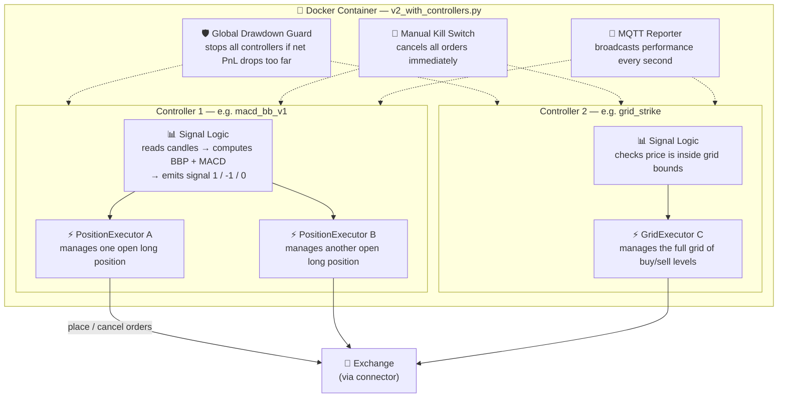
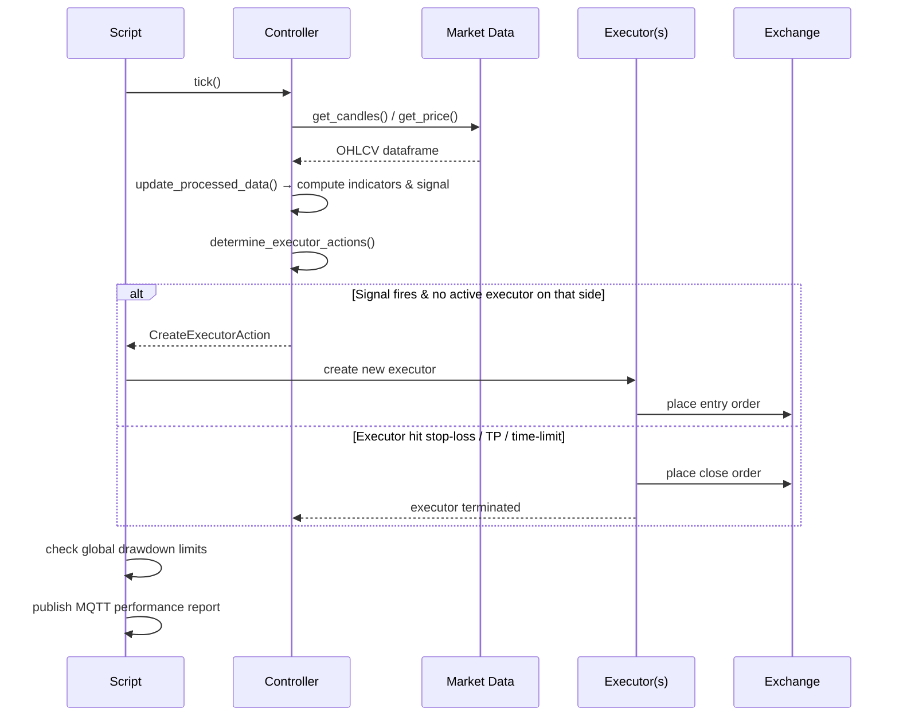
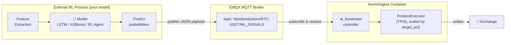
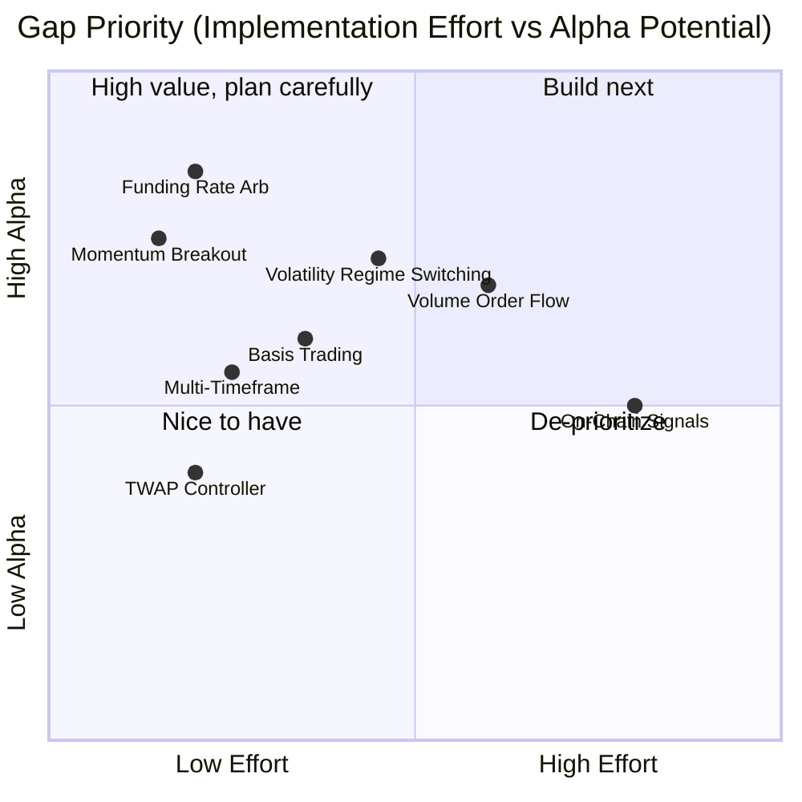
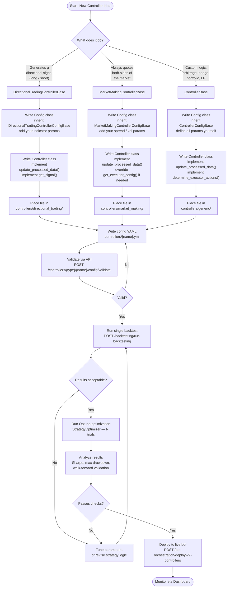

# Controllers Guide: What They Are, What They Do, and What We Need

This guide explains every controller in the stack, how each one works, when to use it, and where the current set of controllers falls short. The final section walks through how to build a new controller from scratch.

---

## Table of Contents

1. [Architecture: How Controllers Work](#1-architecture-how-controllers-work)
2. [Executor Types: The Atomic Building Blocks](#2-executor-types-the-atomic-building-blocks)
3. [Controller Catalog](#3-controller-catalog)
   - [Directional Trading Controllers](#directional-trading-controllers)
   - [Market Making Controllers](#market-making-controllers)
   - [Generic Controllers](#generic-controllers)
4. [Coverage Analysis: What the Current Controllers Cover](#4-coverage-analysis-what-the-current-controllers-cover)
5. [Gaps: What We Probably Need](#5-gaps-what-we-probably-need)
6. [How to Implement a New Controller](#6-how-to-implement-a-new-controller)

---

## 1. Architecture: How Controllers Work

### The Three-Layer Stack

Every live bot runs a single script (`v2_with_controllers.py`) that wires up one or more controllers. The three layers are:



A **controller** is a strategy logic unit. It ticks every second, computes signals, and returns a list of executor actions. It never places orders directly — it tells executors what to do.

An **executor** is an atomic trading unit. It manages the complete lifecycle of one or more orders — entry, risk management (stop-loss, take-profit), and exit — until it terminates.

**What happens each tick (every ~1 second):**



### Base Class Hierarchy

There are three base classes a controller can inherit from, each with different defaults and conveniences:

| Base Class | Best for | Entry order type | Has triple-barrier defaults? |
|-----------|---------|-----------------|------------------------------|
| `DirectionalTradingControllerBase` | Signal → single position | MARKET | Yes |
| `MarketMakingControllerBase` | Always-on quoting both sides | LIMIT | Yes |
| `ControllerBase` (generic) | Everything else | You define it | No |

```mermaid
classDiagram
    class ControllerBase {
        +id: str
        +total_amount_quote: Decimal
        +manual_kill_switch: bool
        +update_processed_data()
        +determine_executor_actions()
    }

    class DirectionalTradingControllerBase {
        +connector_name: str
        +trading_pair: str
        +max_executors_per_side: int
        +cooldown_time: int
        +stop_loss: Decimal
        +take_profit: Decimal
        +time_limit: int
        +get_signal() int
        +get_executor_config()
    }

    class MarketMakingControllerBase {
        +buy_spreads: List~float~
        +sell_spreads: List~float~
        +executor_refresh_time: int
        +stop_loss: Decimal
        +take_profit: Decimal
    }

    ControllerBase <|-- DirectionalTradingControllerBase
    ControllerBase <|-- MarketMakingControllerBase

    class bollinger_v1 { +bb_length +bb_std +bb_long_threshold }
    class macd_bb_v1 { +macd_fast +macd_slow +macd_signal }
    class supertrend_v1 { +length +multiplier +percentage_threshold }
    class ai_livestream { +long_threshold +short_threshold +topic }
    class dman_v3 { +dca_spreads +dca_amounts_pct }
    class pmm_simple { }
    class pmm_dynamic { +natr_length +macd_fast }
    class dman_maker_v2 { +dca_spreads +dca_amounts }
    class grid_strike { +start_price +end_price +limit_price }
    class stat_arb { +entry_threshold +lookback_period }
    class hedge_asset { +hedge_ratio +spot_connector_name }
    class lp_rebalancer { +pool_address +position_width_pct }

    DirectionalTradingControllerBase <|-- bollinger_v1
    DirectionalTradingControllerBase <|-- macd_bb_v1
    DirectionalTradingControllerBase <|-- supertrend_v1
    DirectionalTradingControllerBase <|-- ai_livestream
    DirectionalTradingControllerBase <|-- dman_v3
    MarketMakingControllerBase <|-- pmm_simple
    MarketMakingControllerBase <|-- pmm_dynamic
    MarketMakingControllerBase <|-- dman_maker_v2
    ControllerBase <|-- grid_strike
    ControllerBase <|-- stat_arb
    ControllerBase <|-- hedge_asset
    ControllerBase <|-- lp_rebalancer
```



### The Controller Config

Every controller is backed by a Pydantic config object. The config is serialized to YAML, stored in `bots/conf/controllers/`, and passed to the bot at startup. It can also be updated live via the API while the bot is running.

**Fields shared by all controllers:**

| Field | Description |
|-------|-------------|
| `id` | Unique name for this controller instance |
| `controller_name` | The Python module name (used to find the code) |
| `controller_type` | `"directional_trading"`, `"market_making"`, or `"generic"` |
| `total_amount_quote` | Total capital allocated to this controller |
| `manual_kill_switch` | Set to `true` to immediately stop and cancel all orders |

---

## 2. Executor Types: The Atomic Building Blocks

Understanding executors is key to understanding what any controller actually does in the market.

### PositionExecutor

The most common executor. Manages a **single directional trade** with full triple-barrier risk management.

**Triple barrier = three exits:**
- **Take-profit**: closes at a fixed % gain (can be LIMIT or MARKET)
- **Stop-loss**: closes at a fixed % loss (always MARKET)
- **Time-limit**: closes at market after N seconds regardless of P&L
- **Trailing stop** (optional): activates at `activation_price`, then follows price by `trailing_delta`

**Entry types:**
- `MARKET`: fills immediately at best price (taker fee)
- `LIMIT`: posts a limit order; activates when filled
- `LIMIT_MAKER`: post-only limit order (maker fee); cancels and retries if would fill immediately

**Activation bounds** (optional): the executor sits passively until price comes within `activation_bounds` % of the entry price, then places the open order. Useful for "wait for a dip to enter" logic.

**How the triple barrier works:**

```
  Price
    │
    │  ╔══ TAKE PROFIT ══════════════════════════════╗  entry × (1 + take_profit)
    │  ║  e.g. +2%                                   ║  → LIMIT SELL (maker fee, waits in book)
    │  ╚═════════════════════════════════════════════╝
    │                          ↑ price rises here
    │  ┄┄┄┄ ENTRY ┄┄┄┄┄┄┄┄┄┄┄●┄┄┄┄┄┄┄┄┄┄┄┄┄┄┄┄┄┄┄┄  entry price  (MARKET or LIMIT buy)
    │                          ↓ price falls here
    │  ╔══ STOP LOSS ════════════════════════════════╗  entry × (1 - stop_loss)
    │  ║  e.g. -3%                                   ║  → MARKET SELL (immediate, taker fee)
    │  ╚═════════════════════════════════════════════╝
    │
    └────────────────────────────────────────────────────────►  Time
                                                   │
                                             TIME LIMIT
                                         force MARKET SELL
                                         after N seconds
                                       (whichever barrier
                                        is hit first wins)

  Optional trailing stop:
    ├─ activates once unrealized PnL > trailing_stop_activation (e.g. +1.5%)
    └─ then follows price downward, closes if price retraces trailing_delta (e.g. 0.5%)
```

---

### DCAExecutor

Opens a position across **multiple limit orders at increasing distances** from the reference price (dollar-cost averaging). Once all fills are accumulated into a single position, manages it with unified TP/SL.

```
  Price
    │
  SIGNAL ─────────────────────────────────── BBP < threshold → DCA executor starts
    │
    │  level 0  ──●── LIMIT BUY 10%  ← placed at signal price (tightest spread)
    │                                   fills immediately if price is here
    ↓
    │  level 1  ──○── LIMIT BUY 20%  ← placed 1.8% below signal price
    │                                   waiting for a further dip
    ↓
    │  level 2  ──○── LIMIT BUY 30%  ← placed 15% below signal price
    │                                   deeper retracement
    ↓
    │  level 3  ──○── LIMIT BUY 40%  ← placed 25% below signal price
    │                                   worst-case entry (most capital)
    ↓
  STOP LOSS ──────────────────────────────── MARKET SELL all positions

  Once all levels fill → unified average entry price
  → single TAKE PROFIT order placed above average entry
```

Use when: you want maker-only entries with a soft landing (spread buys over a range instead of all at once at market).

---

### GridExecutor

Manages a **grid of buy/sell orders within a price range** (`start_price` to `end_price`). Each filled level immediately places a take-profit order on the other side. `limit_price` acts as the grid's stop-loss boundary — if breached, the executor terminates.

Key parameters:
- `max_open_orders`: how many orders are live at once (controls capital exposure)
- `order_frequency`: seconds between placing batches of orders
- `triple_barrier_config.take_profit`: the profit per grid level

```
  Price
    │
  end_price   ──────────────────────────────────────  grid ceiling
    │
    │   [level 5]  ○ pending BUY          ← max_open_orders limits how many
    │   [level 4]  ○ pending BUY             are active simultaneously
    │   [level 3]  ● FILLED ──────────────── immediately places SELL at level 3 + TP%
    │   [level 2]  ● FILLED ──────────────── immediately places SELL at level 2 + TP%
    │   [level 1]  ● FILLED ──────────────── immediately places SELL at level 1 + TP%
    │
  start_price ──────────────────────────────────────  grid floor
    │
  limit_price ──────────────────────────────────────  STOP boundary
                                                       ✗ breached → grid terminates

  Each filled BUY level cycles independently:
    BUY filled → place SELL at (buy_price × (1 + take_profit)) → SELL filled → level resets
```

Use when: you expect price to oscillate within a known range.

---

### XEMMExecutor

**Cross-Exchange Market Making.** Places a maker order on one exchange; when filled, immediately hedges on another exchange with a taker order. Profit is the spread between the two prices minus fees.

```
  Exchange A (maker)          Exchange B (taker)
  ─────────────────           ─────────────────
  POST limit BUY @ 100        (waiting)
        │
        │ ← order fills (someone sells to us on A)
        ↓
  position: +1 BTC @ 100      immediately: MARKET SELL 1 BTC @ 100.3
                                            ↑
                               profit = 100.3 - 100 - fees = ~0.2 (target_profitability)

  The XEMM executor tracks the bid/ask spread across both exchanges
  and only posts maker orders when the expected profit corridor is open.
```

Use when: you have accounts on two exchanges with persistent price discrepancies.

---

### ArbitrageExecutor

**Simultaneous arbitrage.** Executes a buy on the cheaper market and a sell on the more expensive market at the same instant. Works with CEX and DEX/AMM connectors.

Use when: a clear and instant price discrepancy exists across two markets.

---

### TWAPExecutor

Executes a large order over time by splitting it into equal-sized slices at regular intervals. Supports maker (limit) or taker (market) mode.

Use when: you need to enter or exit a large position without moving the market.

---

### OrderExecutor

Places a **single order** with one of four strategies: MARKET, LIMIT, LIMIT_MAKER, or LIMIT_CHASER (continuously tracks best bid/ask). No triple-barrier — purely an order placer. Used by simpler controllers like `pmm_v1` and `hedge_asset`.

---

### LPExecutor

Manages a **concentrated liquidity pool position** on a DeFi AMM (Meteora/CLMM on Solana). Creates a position within `[lower_price, upper_price]`, monitors its range status, earns fees when in range, and can auto-close when out of range for too long.

---

## 3. Controller Catalog

---

### Directional Trading Controllers

These controllers all share the same DNA: they watch for a signal, and when the signal fires, they open a position via a `PositionExecutor` (or `DCAExecutor`/`GridExecutor` for the variants). They close positions using the triple-barrier mechanism.

**Shared config fields for all directional controllers:**

| Field | Default | Description |
|-------|---------|-------------|
| `connector_name` | — | Exchange to trade on |
| `trading_pair` | — | Market (e.g., `BTC-USDT`) |
| `total_amount_quote` | 100 | Capital in quote currency |
| `max_executors_per_side` | 2 | Max concurrent open positions per direction |
| `cooldown_time` | 300s | Minimum seconds between opening new positions on the same side |
| `leverage` | 20 | Leverage multiplier (use 1 for spot) |
| `position_mode` | HEDGE | HEDGE = independent long/short; ONEWAY = netted |
| `stop_loss` | 0.03 | 3% stop loss from entry |
| `take_profit` | 0.02 | 2% take profit from entry |
| `time_limit` | 2700s | Force-close position after 45 minutes |
| `take_profit_order_type` | LIMIT | LIMIT or MARKET |
| `trailing_stop` | None | e.g., `"0.015,0.005"` = activate at 1.5% profit, trail by 0.5% |

---

#### `bollinger_v1` — Bollinger Mean Reversion (Simple)

**What it does:** Enters trades when price is near the extreme of a Bollinger Band, betting on a return to the mean.

**Signal logic:**
- Computes BBP (Bollinger Band Percent): 0 = at lower band, 1 = at upper band
- Long when BBP < `bb_long_threshold` (price near or below lower band)
- Short when BBP > `bb_short_threshold` (price near or above upper band)

```
  Price
    │
    │  ╔══════════════════════ Upper Band (SMA + bb_std × σ) ════════════════╗
    │  ║▓▓▓▓▓▓▓▓▓▓▓▓▓▓▓  SHORT zone  (BBP > bb_short_threshold)  ▓▓▓▓▓▓▓▓▓║  BBP = 1.0
    │  ║ ─ ─ ─ ─ ─ ─ ─ ─ ─ ─ ─ ─ ─ ─ ─ ─ ─ ─ ─ ─ ─ ─ ─ ─ ─ ─ ─ ─ ─ ─ ─║  ← bb_short_threshold (e.g. 0.8)
    │  ║                                                                     ║
    │  ║                         NEUTRAL  (no signal)                        ║  BBP = 0.5
    │  ║                                                                     ║
    │  ║ ─ ─ ─ ─ ─ ─ ─ ─ ─ ─ ─ ─ ─ ─ ─ ─ ─ ─ ─ ─ ─ ─ ─ ─ ─ ─ ─ ─ ─ ─ ─║  ← bb_long_threshold (e.g. 0.2)
    │  ║▓▓▓▓▓▓▓▓▓▓▓▓▓▓▓▓  LONG zone  (BBP < bb_long_threshold)  ▓▓▓▓▓▓▓▓▓║  BBP = 0.0
    │  ╚══════════════════════ Lower Band (SMA - bb_std × σ) ════════════════╝
    │
    └──────────────────────────────────────────────────────────────────────►  Time

  BBP = (close - lower_band) / (upper_band - lower_band)
  Tighter thresholds (e.g. 0.0 / 1.0) = fewer signals, at extreme band touches only
  Wider thresholds (e.g. 0.3 / 0.7) = more signals, further from the band edges
```

**Best market condition:** Ranging, sideways market. Loses money in strong trends.

**When to use:** As a simple baseline for mean-reversion strategies on stable, range-bound pairs.

| Parameter | Default | Description |
|-----------|---------|-------------|
| `interval` | `"3m"` | Candle timeframe |
| `bb_length` | 100 | Lookback period (bars) |
| `bb_std` | 2.0 | Band width in standard deviations |
| `bb_long_threshold` | 0.0 | BBP below this → long. 0 = at lower band exactly; 0.2 = 20% up from lower band |
| `bb_short_threshold` | 1.0 | BBP above this → short |

---

#### `bollinger_v2` — Bollinger Mean Reversion (Dual-Library Validation)

**What it does:** Identical strategy to v1, but uses both `pandas_ta` and `talib` to compute the bands, with manual BBP calculation for numerical stability. Loads 5× more candle history.

**When to use:** Drop-in replacement for v1 when you want more robust indicator computation. The increased candle load makes it slightly heavier.

Config is identical to `bollinger_v1`.

---

#### `bollingrid` — Bollinger Mean Reversion + Grid

**What it does:** Combines a Bollinger Band signal with a `GridExecutor`. When price reaches a band extreme, instead of placing a single position, it opens a grid of orders sized and positioned according to the current BB width. Wider bands = larger grids.

**Signal logic:** Same BBP threshold as bollinger_v1.

**Grid sizing (dynamic):**
```
Grid range ≈ current BB width × grid coefficients
Limit price ≈ beyond start by another fraction of BB width
```

**Best market condition:** Ranging markets with volatility clustering — bands widen when volatility spikes, meaning the grid automatically adapts to the volatility regime.

**When to use:** When you want mean-reversion exposure but with smoother entry (grid of limit orders vs single market order).

| Parameter | Default | Description |
|-----------|---------|-------------|
| `bb_length` | 100 | |
| `bb_std` | 2.0 | |
| `bb_long_threshold` | 0.0 | |
| `bb_short_threshold` | 1.0 | |
| `grid_start_price_coefficient` | 0.25 | Grid start = entry ± (BB_width × 0.25) |
| `grid_end_price_coefficient` | 0.75 | Grid end = entry ± (BB_width × 0.75) |
| `grid_limit_price_coefficient` | 0.35 | Stop boundary = entry ± (BB_width × 0.35) beyond start |
| `min_spread_between_orders` | 0.005 | Min % between grid levels |
| `min_order_amount_quote` | 6 | Min notional per level |
| `max_open_orders` | 5 | Max simultaneous live levels |
| `order_frequency` | 2s | Delay between placing batches |
| `max_orders_per_batch` | 1 | Levels placed per tick |

---

#### `dman_v3` — Dynamic Market Adaptive (DCA Entry)

**What it does:** Bollinger Band signal, but entries are made via a DCA ladder of **limit orders** (maker-only). It places multiple buy orders at increasing distances below the entry price (for longs), averaging in as price falls. Optional: spreads and stop levels scale dynamically with BB width.

**Signal logic:** Same BBP threshold as bollinger_v1.

**Best market condition:** Mean-reverting markets where you expect further adverse movement before the reversal. The DCA approach reduces entry price vs a single market order.

**When to use:** When fills are a concern, or when you want a tighter average entry price than market orders give you. Note: if price keeps falling past all DCA levels and hits the stop-loss, the loss is larger than a simple PositionExecutor.

| Parameter | Default | Description |
|-----------|---------|-------------|
| `bb_length` | 100 | |
| `bb_std` | 2.0 | |
| `bb_long_threshold` | 0.0 | |
| `bb_short_threshold` | 1.0 | |
| `dca_spreads` | `[0.001, 0.018, 0.15, 0.25]` | Distance from entry per DCA level |
| `dca_amounts_pct` | equal split | Relative capital per level |
| `dynamic_order_spread` | false | Scale spreads by BB width |
| `dynamic_target` | false | Scale SL by BB width |
| `trailing_stop` | `"0.015,0.005"` | Default trailing stop (vs None in other controllers) |

---

#### `macd_bb_v1` — MACD + Bollinger (Dual Confirmation)

**What it does:** Adds MACD as a confirmation filter on top of the Bollinger Band signal. Requires both indicators to agree before entering.

**Signal logic:**
- **Long**: BBP < threshold AND MACD histogram > 0 AND MACD line < 0
  - *Interpretation*: price is near the lower band AND momentum is turning upward but MACD is still net negative (early momentum reversal confirmation)
- **Short**: BBP > threshold AND MACD histogram < 0 AND MACD line > 0

```
  Bollinger condition ── price near lower band (BBP < threshold):
  ┌────────────────────────────────────────────────────────────────────┐
  │  Upper Band  ──────────────────────────────────────────────────    │
  │                                                                    │
  │  Lower Band  ─────────────────────────────────────────────╮───    │
  │                                                    close ←╯        │
  └────────────────────────────────────────────────────────────────────┘
               ↓ BBP < threshold ✓

  MACD condition ── histogram turning positive while line still negative:

   MACD line:   ────────╲────────────────────────────────
                         ╲__________  ← still below zero ✓
   MACD hist:   ─────────────────────╱  ← histogram > 0 ✓
                                    ╱
                           LONG SIGNAL fires here ──────●
                           (both conditions met at the same bar)

  Why this matters: MACD line < 0 confirms price is still "oversold"
  on a medium-term basis. Histogram > 0 means selling pressure is
  fading and momentum is reversing. Together with BBP, this is a
  higher-quality signal than Bollinger alone.
```

**Best market condition:** Ranging with momentum structure. Filters out false breakout signals that would trigger a pure Bollinger strategy.

**When to use:** When you find too many false signals with pure Bollinger. The dual confirmation reduces trade frequency but improves signal quality.

| Parameter | Default | Description |
|-----------|---------|-------------|
| `bb_length` | 100 | |
| `bb_std` | 2.0 | |
| `bb_long_threshold` | 0.0 | |
| `bb_short_threshold` | 1.0 | |
| `macd_fast` | 21 | Fast EMA period |
| `macd_slow` | 42 | Slow EMA period |
| `macd_signal` | 9 | Signal line smoothing period |

---

#### `supertrend_v1` — Supertrend Trend Following

**What it does:** Uses the SuperTrend indicator to detect and follow trends. Only enters when price is **close to the SuperTrend line** (fresh trend entry), not after the price has already run far.

**Signal logic:**
- SuperTrend direction +1 = uptrend (long), -1 = downtrend (short)
- `percentage_distance` = distance from current close to SuperTrend line / close price
- Only signals when `percentage_distance < percentage_threshold`

```
  Price
    │                   ╭──── close price
    │              ╭────╯
    │         ╭────╯
    │    ╭────╯   ↑                   ↑ SuperTrend flips to +1 (uptrend)
    │────╯        │                   │ SuperTrend line (ATR-based)
    │             ╰── SuperTrend line ╯
    │
    │    ← NO SIGNAL →   ← SIGNAL ZONE →   ← NO SIGNAL →
    │    price too far     close is within    price already
    │    from line         percentage_         ran too far
    │                      threshold of line   from line
    │
    │    ╔═══════════════════════════════════╗
    │    ║  LONG signal fires only when:     ║
    │    ║  • SuperTrend direction = +1      ║
    │    ║  • |close - ST_line| / close      ║
    │    ║        < percentage_threshold     ║
    │    ╚═══════════════════════════════════╝
    └──────────────────────────────────────────────────────────────────►  Time

  This proximity filter ensures entries happen at fresh trend initiations,
  not after the price has already moved far from the SuperTrend line.
```

**Best market condition:** Strong trending markets. Unlike Bollinger-based controllers, it performs poorly in ranging conditions (SuperTrend will whipsaw).

**When to use:** On assets with strong trend characteristics (momentum coins, market in a clear directional move).

| Parameter | Default | Description |
|-----------|---------|-------------|
| `interval` | `"3m"` | |
| `length` | 20 | ATR lookback period |
| `multiplier` | 4.0 | ATR band multiplier (higher = fewer but stronger signals) |
| `percentage_threshold` | 0.01 | Max 1% distance from SuperTrend line to signal |

---

#### `ai_livestream` — External ML Model via MQTT

**What it does:** A receiver controller for external ML model signals. It subscribes to an MQTT topic where your model publishes probability distributions over three classes (short, neutral, long) plus a per-bar volatility target.

**Signal logic:**
- Long when `long_probability > long_threshold`
- Short when `short_probability > short_threshold`
- TP, SL, and trailing stop are scaled by `target_pct` from the model (volatility-adaptive barriers)

**Best market condition:** Whatever your external model was trained for.

**When to use:** When you have a trained ML model (LSTM, XGBoost, reinforcement learning agent, etc.) running externally and want to connect it to the execution stack. The model publishes to MQTT; this controller listens and acts.



**MQTT payload format:**
```json
{
  "probabilities": [0.1, 0.2, 0.7],  // [short_prob, neutral_prob, long_prob]
  "target_pct": 0.012                  // model's volatility forecast → scales TP/SL
}
```

The barriers scale as: `take_profit = target_pct`, `stop_loss = target_pct`, `trailing_stop_activation = target_pct × 0.5`. This makes risk management adaptive to the model's confidence in volatility.

| Parameter | Default | Description |
|-----------|---------|-------------|
| `long_threshold` | 0.5 | Minimum long probability to trigger |
| `short_threshold` | 0.5 | Minimum short probability to trigger |
| `topic` | `"hbot/predictions"` | MQTT base topic (pair appended automatically) |

---

#### `arimax_fip720_mean_reversion` — SARIMAX Statistical Model

**What it does:** The most sophisticated directional controller. Loads a pre-trained SARIMAX(1,0,1) statistical model and uses three features to forecast the next bar's return:

1. **FIP720** (Frog In The Pan): measures whether momentum is consistent (few direction changes = stronger momentum score) over a 720-bar window
2. **Z-score**: how far current price is from its 200-bar rolling mean
3. **BBP**: standard Bollinger Band Position

**Signal logic:**
- Long: model forecasts positive return AND (z_score < -threshold OR BBP < 0) — model says up AND price is oversold
- Short: model forecasts negative return AND (z_score > threshold OR BBP > 1) — model says down AND price is overbought

**Notable:** The model is applied statelessly each tick with `model.apply()` to advance its internal Kalman filter state. This means the model's signal adapts as the regime changes, not just at a fixed snapshot.

**Best market condition:** Mean-reverting. The model was trained on that assumption.

| Parameter | Default | Description |
|-----------|---------|-------------|
| `interval` | `"1m"` | |
| `model_path` | `"models/arimax_fip720_mr.joblib"` | Path to `.joblib` model file |
| `fip_lookback` | 720 | Bars for FIP indicator |
| `zscore_window` | 200 | Rolling z-score window |
| `bb_length` | 20 | For BBP filter |
| `bb_std` | 2.0 | |
| `z_threshold` | 1.5 | Z-score trigger level |

---

#### `market_opening` — US Equity Open Session Strategy

**What it does:** A session-filtered momentum strategy that only trades during configurable hours (default: 9–11 AM US/Eastern = NY equity market open). Uses three-way confirmation:

1. **EMA alignment**: short EMA > mid EMA > long EMA (bullish stack) or inverse
2. **TrendFury**: OLS regression slope of recent price + VWAP comparison → proprietary trend score
3. **MACD histogram**: direction confirmation

**Signal logic:**
- Long: bullish EMA stack AND (TrendFury > 0 OR MACD > 0)
- Short: bearish EMA stack AND (TrendFury < 0 OR MACD < 0)
- Outside session hours: no new positions (existing positions continue to run until their barriers close them)

**Best market condition:** High volatility, directional moves during market open hours. Not suitable for all-hours trading.

| Parameter | Default | Description |
|-----------|---------|-------------|
| `interval` | `"5m"` | |
| `start_hour` | 9 | Session start (local timezone) |
| `end_hour` | 11 | Session end |
| `timezone` | `"America/New_York"` | |
| `ema_lengths` | `[5, 20, 50]` | Short, mid, long EMA periods |
| `trend_fury_window` | 48 | OLS slope period |

---

### Market Making Controllers

Market making controllers **always quote both sides** of the market simultaneously. They don't wait for a directional signal — they place limit orders on both the bid and ask, earn the spread when both sides fill, and manage inventory risk via triple-barrier exits.

**Shared config fields for all market making controllers:**

| Field | Default | Description |
|-------|---------|-------------|
| `buy_spreads` | `[0.01, 0.02]` | List of spreads as fraction of price for each buy level |
| `sell_spreads` | `[0.01, 0.02]` | Same for sell levels |
| `buy_amounts_pct` | equal split | Relative capital weight per buy level |
| `sell_amounts_pct` | equal split | Same for sell levels |
| `executor_refresh_time` | 300s | Cancel and repost unfilled orders after this duration |
| `cooldown_time` | 15s | After a stop-loss fill, pause before repricing that level |
| `leverage` | 20 | |
| `stop_loss` | 0.03 | |
| `take_profit` | 0.02 | |
| `time_limit` | 2700s | |

---

#### `pmm_simple` — Pure Market Making (Simple)

**What it does:** The simplest PMM. Posts one limit order per spread level on each side of the mid price. Refreshes every `executor_refresh_time` if unfilled. Each fill becomes a `PositionExecutor` managed with triple-barrier exits.

**Best market condition:** Liquid, stable markets with consistent two-way flow.

**When to use:** As a baseline PMM. Simple to tune, easy to understand.

No additional parameters beyond the shared market making fields.

---

#### `pmm_dynamic` — Volatility-Adaptive Market Making

**What it does:** Extends `pmm_simple` with two dynamic adjustments:

1. **Spread widening**: uses NATR (Normalized ATR) as a spread multiplier. In volatile periods, spreads widen automatically, protecting against adverse selection.
2. **Price skew**: uses MACD to shift the reference price (mid price). Positive MACD momentum → the controller quotes higher (discourages more buys, encourages sells). Negative momentum → quotes lower. This prevents inventory buildup in trending conditions.

**Best market condition:** Any market, but especially volatile or trending markets where a fixed-spread PMM would accumulate too much directional inventory.

| Parameter | Default | Description |
|-----------|---------|-------------|
| `interval` | `"3m"` | |
| `macd_fast` | 21 | |
| `macd_slow` | 42 | |
| `macd_signal` | 9 | |
| `natr_length` | 14 | ATR normalization period |
| `buy_spreads` | `[1, 2, 4]` | Spread units of NATR (e.g., 1× NATR, 2× NATR, 4× NATR) |
| `sell_spreads` | `[1, 2, 4]` | |

---

#### `dman_maker_v2` — D-Man Market Maker (DCA Entries)

**What it does:** A market making controller that uses `DCAExecutor` instead of `PositionExecutor` for entries. It simultaneously places multi-level DCA ladders on both the buy side and the sell side. This gives it softer entry prices and can absorb more order flow before hitting risk limits.

**Best market condition:** Ranging markets with high order flow. Better inventory management than simple PMM in choppy conditions.

| Parameter | Default | Description |
|-----------|---------|-------------|
| `dca_spreads` | `[0.01, 0.02, 0.04, 0.08]` | Spread per DCA entry level |
| `dca_amounts` | `[0.1, 0.2, 0.4, 0.8]` | Relative size per level |
| `top_executor_refresh_time` | None | Faster refresh for level 0 only (tightest spread) |
| `executor_activation_bounds` | None | Level only activates when price is within this distance |

---

### Generic Controllers

Generic controllers inherit from `ControllerBase` directly and implement custom logic. They are not constrained to the directional or market-making patterns.

---

#### `pmm_v1` — Legacy Pure Market Making (Spot)

**What it does:** A port of the legacy `pure_market_making` script into the V2 controller framework. The key difference from `pmm_simple`: order sizes are in **base asset** (not quote), and it includes classic PMM features:

- **Inventory skew**: if base balance deviates from target ratio, the controller automatically reduces size on the oversupplied side and increases it on the undersupplied side
- **Price ceiling/floor**: static price limits that block orders above/below configured levels
- **Refresh tolerance**: avoids unnecessary cancellations if price has barely moved
- **Filled order delay**: after a fill, delays repricing that level for N seconds

**When to use:** Spot market making where inventory balance matters and you want fine-grained control over order refresh behavior.

| Parameter | Default | Description |
|-----------|---------|-------------|
| `order_amount` | 1 | Per-level size in **base asset** |
| `buy_spreads` | `[0.01]` | |
| `sell_spreads` | `[0.01]` | |
| `order_refresh_time` | 30s | Refresh cycle |
| `order_refresh_tolerance_pct` | -1 | `-1` = always refresh; positive = min % price move required |
| `filled_order_delay` | 60s | Pause after fill |
| `inventory_skew_enabled` | false | Enable inventory rebalancing |
| `target_base_pct` | 0.5 | Target base/quote ratio |
| `price_ceiling` | -1 | Block buys above this price (-1 = disabled) |
| `price_floor` | -1 | Block sells below this price (-1 = disabled) |

---

#### `pmm_mister` — Advanced PMM (Portfolio-Aware)

**What it does:** The most feature-complete PMM. Designed for running multiple pairs simultaneously with shared capital. Key additions over `pmm_simple`:

- **Portfolio allocation**: sizes each order as `portfolio_allocation × total_capital`
- **Inventory skew** with configurable min/max base ratios
- **Hanging executors**: filled orders are held ("hung") for a configurable period before the slot is opened again — prevents immediately re-quoting the same level into a trending move
- **Per-side cooldowns and tolerance**: more control over when orders refresh
- **Global P&L guardrails**: stops all executors if aggregate position PnL exceeds a global TP or SL
- **Tick mode** and **position profit protection**: advanced filters to reduce adverse selection

**When to use:** When running PMM across multiple pairs from a single capital pool, or when you need finer control over when to re-quote after fills.

| Parameter | Default | Description |
|-----------|---------|-------------|
| `portfolio_allocation` | 0.1 | Fraction of total capital for this controller |
| `target_base_pct` | 0.5 | Target inventory ratio |
| `min_base_pct` / `max_base_pct` | 0.3 / 0.7 | Skew boundaries |
| `buy_cooldown_time` | 60s | Gap between consecutive buys |
| `sell_cooldown_time` | 60s | Gap between consecutive sells |
| `buy_position_effectivization_time` | 120s | How long before a filled buy "counts" (held) |
| `global_take_profit` | 0.03 | Stop all positions at 3% net PnL |
| `global_stop_loss` | 0.05 | Stop all positions at -5% net PnL |

---

#### `grid_strike` — Fixed-Range Grid Trading

**What it does:** Creates a single `GridExecutor` within a fixed price range (`start_price` to `end_price`). Only active when mid price is between the bounds. If the grid terminates and price returns to range, it starts a new grid.

**How a grid works:**
1. Places buy orders spaced evenly between `start_price` and `end_price`
2. Each filled buy immediately places a sell order one `take_profit` step higher
3. If price falls below `limit_price`, the grid terminates (stop-loss)
4. `max_open_orders` controls how many levels are live at once (capital efficiency)

**Best market condition:** Price expected to oscillate within a known, bounded range.

```
  Price
    │
  end_price   $45,000 ══════════════════════════════════════  grid ceiling
    │
    │          $44,600  ○ BUY level 5  (pending)
    │          $44,200  ● BUY level 4  FILLED → SELL placed @ $44,244  (+0.1% TP)
    │          $43,800  ● BUY level 3  FILLED → SELL placed @ $43,844
    │    ▶     $43,500  ← current price
    │          $43,400  ● BUY level 2  FILLED → SELL placed @ $43,444
    │          $43,000  ○ BUY level 1  (pending, not yet reached)
    │
  start_price $42,000 ══════════════════════════════════════  grid floor
    │
  limit_price $41,000 ══════════════════════════════════════  STOP boundary
    │                                                          ✗ grid terminates if breached
    │
    └──────────────────────────────────────────────────────────────────► Time

  Each level is independent: when SELL is triggered, that level resets and
  a new BUY is placed. The grid runs until limit_price is breached or the
  controller is manually stopped.
```

**When to use:** When you have a price level thesis — e.g., "BTC will range between $42K and $45K for the next week." The quants-lab trend-follower pipeline uses this controller to express grid-based entries on assets with strong EMA momentum signals.

| Parameter | Default | Description |
|-----------|---------|-------------|
| `start_price` | — | Grid lower bound |
| `end_price` | — | Grid upper bound |
| `limit_price` | — | Stop boundary (below start for BUY grid) |
| `side` | BUY | Initial direction |
| `min_spread_between_orders` | 0.001 | Min % spacing between levels |
| `min_order_amount_quote` | 5 | Min notional per level |
| `max_open_orders` | 2 | Max simultaneously live levels |
| `order_frequency` | 3s | Delay between placing batches |
| `keep_position` | false | Hold position when grid terminates |
| `triple_barrier_config` | TP=0.001, LIMIT_MAKER | Risk config per grid level |

---

#### `multi_grid_strike` — Multiple Concurrent Grids

**What it does:** Runs multiple independent `GridExecutor`s simultaneously on the same pair, each covering a different price zone with its own capital allocation. Each sub-grid has its own `start_price`, `end_price`, `limit_price`, and `amount_quote_pct`.

Grids can be enabled/disabled via a live config update without restarting the bot.

**When to use:** When you have multiple price zones of interest on the same asset — e.g., a "safe" zone close to current price and a "dip-buy" zone further below.

---

#### `xemm_multiple_levels` — Cross-Exchange Market Making (Multi-Level)

**What it does:** Quotes multiple tiers of cross-exchange market making simultaneously. For each tier, it specifies a `target_profitability` and `amount`. It runs maker orders on one exchange and hedges fills with taker orders on another. Tracks buy/sell imbalance and blocks new executors if too many of one side have filled without the other.

**When to use:** When you have significant presence on two exchanges with persistent price discrepancy (e.g., a less liquid CEX vs Binance, or CEX vs perpetual vs spot).

---

#### `arbitrage_controller` — Cross-Market Arbitrage

**What it does:** Continuously runs two arbitrage executors (buy-on-A/sell-on-B and buy-on-B/sell-on-A) simultaneously. When a price discrepancy > `min_profitability` is detected, it immediately executes both legs. Handles CEX–DEX arbitrage by fetching AMM gas costs via the Gateway.

**When to use:** When you have capital on two markets and a latency advantage to execute simultaneously. Note: this is pure latency/execution-based arb, not statistical.

---

#### `stat_arb` — Statistical Arbitrage (Pair Trading)

**What it does:** The most sophisticated two-asset strategy. Trades the spread between two cointegrated perpetual assets using an OLS regression model.

**How it works:**
1. Each tick, computes cumulative returns for both assets since bot start
2. Fits OLS: `hedge_return = alpha + beta × dominant_return`
3. Spread = residual (how far hedge has moved relative to what the model predicts given dominant's move)
4. Z-score of that spread over `lookback_period` bars
5. When z-score is extreme (> `entry_threshold`), the spread is too wide: enter convergence trade (long the underperformer, short the outperformer)
6. Exits are both individual (per-fill TP via LIMIT_MAKER) and global (combined PnL TP/SL)

```
  Cumulative Returns
    │
    │  SOL (dominant) ─────────────────────────────────────────────────╮──
    │                                                                  ╱
    │  POPCAT (hedge) ──────────────────────────╮──────────────────╮──
    │  OLS predicted ──────────────────────────╱──────────────────╱
    │
  Spread (residual = actual hedge - predicted hedge):
    │
  +2σ ─ ─ ─ ─ ─ ─ ─ ─ ─ ─ ─ ─ ─ ─ ─ ─ ─ ─ ─ ─ ─ ─ ─  entry_threshold
    │                              ╭──╮
  +1σ                             ╱    ╲
    │                            ╱      ╲         ╭─
   0  ─────────────────────────╱──────────────────╱──  mean
    │              ╮                              ╱
  -1σ              ╰──────────────────────────────
    │
  -2σ ─ ─ ─ ─ ─ ─ ─ ─ ─ ─ ─ ─ ─ ─ ─ ─ ─ ─ ─ ─ ─ ─ ─  -entry_threshold
    │         ↑                       ↑
    │  z > +threshold:          z > +threshold again:
    │  hedge outperformed        SHORT hedge, LONG dominant
    │  → SHORT hedge, LONG dominant  (convergence bet)
    └──────────────────────────────────────────────────────────────────► Time
```

**Best market condition:** Two assets that historically move together but have temporarily diverged. Works on perpetuals where you can short both legs.

**When to use:** When your research identifies a cointegrated pair with a currently-diverged spread. The quants-lab can compute and track these signals via MongoDB.

---

#### `hedge_asset` — Delta-Neutral Portfolio Hedge

**What it does:** Automatically maintains a short perpetual position sized to offset a spot holding. If you hold 100 SOL on a spot exchange, this controller opens a `100 × hedge_ratio` SOL short on the perpetual exchange. As your spot balance changes, the short is adjusted to match. Updating `hedge_ratio` live increases or decreases the hedge fraction.

**When to use:** When you want to hold an asset for yield (staking, liquidity provision, vaults) without directional price exposure.

---

#### `quantum_grid_allocator` — Portfolio Rebalancing via Grids

**What it does:** A portfolio manager that maintains target allocations across multiple spot assets using grids. For each asset:

- If actual allocation < target - threshold → buy-only grid mode
- If actual allocation > target + threshold → sell-only grid mode
- Otherwise → bidirectional grid (both buy and sell grids active)

Grid sizes and ranges scale with deviation from target. Optionally uses Bollinger Band width for dynamic grid ranges.

**When to use:** Systematic portfolio rebalancing for a multi-asset spot portfolio. Replaces manual "buy the dips, sell the rips" rebalancing with an automated grid-based approach.

---

#### `lp_rebalancer` — DeFi Liquidity Provider

**What it does:** Manages a concentrated liquidity position on a CLMM DEX (Meteora on Solana). Creates a narrow range position, earns trading fees while in range, and automatically rebalances (closes and reopens in a new range) when price moves out of range for too long.

Supports three position modes:
- **BOTH** (side=0): symmetric position around current price, earns fees bidirectionally
- **BUY** (side=1): position below current price (quote-only required), earns fees if price falls into range
- **SELL** (side=2): position above current price (base-only required), earns fees if price rises into range

```
  Price
    │
    │   ──────── sell_price_max ──────────────────────────────  upper allowed zone boundary
    │   ┌──────────────────────────────────────┐
    │   │   SELL position (side=2)             │  ← base tokens only
    │   │   above current price                │    earns fees if price rises here
    │   └──────────────────────────────────────┘
    │              ← position_width_pct →
    │                     ▶  current price  ◀
    │   ┌──────────────────────────────────────┐
    │   │   BUY position (side=1)              │  ← quote tokens only
    │   │   below current price                │    earns fees if price falls here
    │   └──────────────────────────────────────┘
    │   ──────── buy_price_min ───────────────────────────────  lower allowed zone boundary
    │
    └──────────────────────────────────────────────────────────────────► Time

  Rebalancing trigger (when price moves out of range):
    ┌──────────────────────────────────────────────────────────────┐
    │  price out of range for > rebalance_seconds                  │
    │  AND deviation > rebalance_threshold_pct of boundary         │
    │         ↓                                                    │
    │  1. Close current LP position (collect fees + tokens)        │
    │  2. Determine new side from price direction                  │
    │  3. Validate new position is within allowed price limits     │
    │  4. Open new LP position on the new side                    │
    └──────────────────────────────────────────────────────────────┘
```

`sell_price_min/max` and `buy_price_min/max` define allowed zones to prevent rebalancing into extreme price levels.

**When to use:** Yield generation from on-chain liquidity provision. Requires a Solana wallet connected via the Gateway service.

---

## 4. Coverage Analysis: What the Current Controllers Cover

### Strategy Coverage Map

| Market Condition | Suitable Controllers |
|-----------------|---------------------|
| Ranging / Mean-reverting | bollinger_v1, bollinger_v2, macd_bb_v1, dman_v3, bollingrid, pmm_simple, dman_maker_v2 |
| Trending / Momentum | supertrend_v1, market_opening |
| Grid / Oscillating range | grid_strike, multi_grid_strike, bollingrid |
| Cross-exchange basis | xemm_multiple_levels, arbitrage_controller |
| Pair trading / Spread | stat_arb |
| ML/External signals | ai_livestream |
| Statistical model | arimax_fip720_mean_reversion |
| Portfolio management | quantum_grid_allocator, hedge_asset |
| DeFi / On-chain | lp_rebalancer |
| Delta neutral | hedge_asset |

### Controller Coverage by Market Regime

```
                        RANGING ◄────────────────────────────► TRENDING
                           │                                        │
  HIGH    ─────────────────┼────────────────────────────────────────┼
  VOL     │  bollingrid    │ pmm_dynamic                            │ market_opening
          │  dman_v3       │                                        │
          │  dman_maker_v2 │                                        │
          │                │                                        │
          ─────────────────┼────────────────────────────────────────┼
  LOW     │  bollinger_v1  │ pmm_simple                             │ supertrend_v1
  VOL     │  bollinger_v2  │ pmm_mister                             │
          │  macd_bb_v1    │ pmm_v1                                 │
          │  grid_strike   │                                        │
          └────────────────┴────────────────────────────────────────┘

  SPECIAL STRATEGIES (market-regime independent):
  ┌─────────────────────────────────────────────────────────────────┐
  │  stat_arb          → two-asset spread convergence               │
  │  arbitrage_controller → instant cross-market price discrepancy  │
  │  xemm_multiple_levels → cross-exchange basis                    │
  │  hedge_asset        → delta-neutral portfolio hedge             │
  │  quantum_grid_allocator → multi-asset spot portfolio rebalancing│
  │  lp_rebalancer      → DeFi concentrated liquidity provision     │
  │  ai_livestream      → external ML model (any regime)           │
  │  arimax_fip720      → statistical mean-reversion model          │
  └─────────────────────────────────────────────────────────────────┘
```

### What the Current Set Does Well

- **Mean-reversion on CEX perps** is very well covered: 5+ controllers, with basic and advanced variants, DCA entries, grid entries, and a statistical model
- **Grid trading** has multiple sophisticated implementations: single grid, multi-grid, volatility-adaptive sizing
- **Market making** is well-covered: from simple to portfolio-aware, with DCA variants
- **Cross-exchange** opportunities are covered for both basis trading and pure arbitrage
- **DeFi/AMM** is available via the LP stack
- **External ML integration** exists via the MQTT-based `ai_livestream`

---

## 5. Gaps: What We Probably Need

After auditing all 22 controllers, here are the gaps where the current set falls short.

**Gap priority overview:**



---

### Gap 1: Funding Rate Arbitrage

**What's missing:** No controller exists to systematically capture the funding rate spread between a spot position and a perpetual short (classic cash-and-carry), or between two perpetuals on different exchanges.

**Why it matters:** Perpetual funding rates can be 30–100%+ APR on certain assets during market extremes. This is low-risk, market-neutral yield that requires no directional signal — just execution.

**What it would look like:**
- Monitor funding rates via the hummingbot-api market data feeds
- When `funding_rate × annualized_factor > target_yield_threshold`:
  - Open spot long on `spot_connector` + perpetual short on `perp_connector` (same asset, same size)
  - Monitor funding payments received each 8-hour period
  - Close when funding rate falls below `exit_threshold`
- Risk: basis risk (price of spot vs perp diverges), liquidation on perp side if leverage is too tight

```
  Funding Rate Arb — cash-and-carry structure:

  SPOT exchange              PERP exchange          Net position
  ─────────────              ─────────────          ────────────
  BUY 1 SOL @ $100    +     SHORT 1 SOL-PERP       Delta-neutral
                             @ $100 (1× leverage)   (no price risk)
         │                         │
         │                         │  Every 8h: funding payment received
         │                         ↓  if funding rate is positive (longs pay shorts)
         │                    +$0.08  (0.08% × $100 notional)
         │
         └──────── annualized yield ≈ funding_rate × 3 × 365 ──────────

  Entry: funding_rate × 3 × 365 > target_yield_threshold (e.g. 20% APR)
  Exit:  funding_rate < exit_threshold (e.g. 5% APR annualized)
  Risk:  basis spread between spot and perp prices (usually <0.1%)
```

**Base executor to use:** `OrderExecutor` (MARKET) for both legs simultaneously.

---

### Gap 2: Pure Momentum / Breakout

**What's missing:** No controller for Donchian Channel breakouts, N-day high/low breakouts, or volume-confirmed momentum entries. `supertrend_v1` follows trends but only after they start — it doesn't have a breakout trigger.

**Why it matters:** Breakout strategies are one of the most empirically validated strategies in crypto, particularly for altcoins. They perform in opposite conditions to the mean-reversion controllers we already have, which makes them a natural complement in a portfolio.

**What it would look like:**
- Track rolling N-bar highest high / lowest low (Donchian channel)
- **Long**: current close breaks above the highest high of the last N bars
- **Short**: current close breaks below the lowest low of the last N bars
- Optional: require volume > rolling average volume (confirms the breakout is real)
- Exit via triple-barrier (existing PositionExecutor handles this fine)

**Indicators to use:** `pandas_ta.donchian()`, rolling max/min, volume ratio.

---

### Gap 3: Volatility Regime Switching

**What's missing:** No controller can detect whether the market is currently in a high-volatility (trending) or low-volatility (ranging) regime and route to the appropriate sub-strategy accordingly.

**Why it matters:** Most of our controllers are optimized for one regime. Running a mean-reversion controller (bollinger) in a trending regime is one of the most common causes of losses. A regime-switching layer would reduce drawdowns significantly.

**What it would look like:**
- Compute a volatility regime indicator:
  - **ADX** > 25 = trending regime; ADX < 20 = ranging regime
  - Or: BBands width vs its historical percentile (wide = high vol/trending, narrow = ranging)
  - Or: HMM (Hidden Markov Model) trained on realized volatility — already partially possible via `ai_livestream` if the model is external
- Based on regime, activate one set of executors and deactivate another within the same controller

This is best implemented as a meta-controller or as a feature added to a new controller class. It could also be done at the quants-lab level (the pipeline stops/starts bots based on regime signals).

---

### Gap 4: Multi-Timeframe Confluence

**What's missing:** No controller uses signals from multiple timeframes simultaneously (e.g., trend direction on 1h, entry on 5m). `market_opening` gets close but it's session-based, not timeframe-confluence-based.

**Why it matters:** Multi-timeframe analysis is fundamental in traditional trading. Using a higher timeframe for bias (direction) and a lower timeframe for entry (timing) dramatically improves signal quality.

**What it would look like:**
- Load candles at two intervals: e.g., 1h for trend, 5m for entry
- **Bias**: 1h SuperTrend or 1h EMA direction defines allowed direction (only take longs if 1h is bullish)
- **Entry**: 5m BBP or MACD confirms an oversold dip within the bullish 1h trend
- Result: only buys on dips during uptrends — no countertrend trades

The existing controller infrastructure supports multiple candle subscriptions with `candles_config` list, so this is technically straightforward to implement.

---

### Gap 5: Volume / Order Flow Signals

**What's missing:** No controller uses order book data, trade flow, or liquidation data as primary signals. All existing signals are purely price-based (OHLCV).

**Why it matters:** Order flow is one of the most predictive short-term signals in crypto. Large buy/sell imbalances in the order book, liquidation cascades, and delta (buy volume - sell volume) are all highly predictive of short-term price direction.

**What it would look like:**
- Subscribe to `order_book` and `trades` feeds (already available via hummingbot-api market data endpoints)
- Compute: bid/ask volume imbalance, cumulative delta over a window, VWAP deviation
- Signal: if bid volume > ask volume by a threshold AND price is near VWAP → long signal
- This requires real-time data feeds rather than candle-based batch computation — a different architecture from most current controllers, but the underlying market data feeds are already available

---

### Gap 6: On-Chain / Crypto-Native Signals

**What's missing:** No controller integrates on-chain data (funding rates across exchanges, open interest, large wallet flows, social sentiment) as primary signals.

**Why it matters:** Crypto markets have unique data sources that don't exist in traditional finance. Open interest spikes often precede volatility. Extreme funding rates are a contrarian signal. These are alpha sources that are not captured by any current controller.

**Practical near-term options:**
- **Funding rate signal**: already collected by `funding_rates_task.py` in quants-lab — just needs a controller that reads it
- **Open interest signal**: `oi_task.py` exists in quants-lab — needs a controller integration
- Routing these signals through the MQTT `ai_livestream` controller is the fastest path without building a new controller

---

### Gap 7: TWAP/VWAP Execution Controller

**What's missing:** There is a `TWAPExecutor` in the executor layer, but no controller that uses it intelligently. A controller that breaks large positions into TWAP/VWAP slices based on portfolio-level signals does not exist.

**Why it matters:** When the quants-lab wants to build a large position in an asset (e.g., based on an EMA trend signal), deploying capital all at once is suboptimal. A TWAP controller would automate this.

---

### Gap 8: Basis / Perpetual-Spot Spread Controller

**What's missing:** A controller that monitors the spread between a perpetual and its underlying spot price and takes positions when the spread is anomalous. Related to Gap 1 (funding arb) but more focused on price convergence rather than funding yield.

---

### Summary: Gap Priority Table

| Gap | Implementation Effort | Potential Alpha | Priority |
|-----|----------------------|-----------------|---------|
| Funding Rate Arbitrage | Low–Medium | High | **High** |
| Pure Momentum / Breakout | Low | High | **High** |
| Multi-Timeframe Confluence | Low | Medium | **Medium** |
| Volatility Regime Switching | Medium | High | **Medium** |
| Volume / Order Flow Signals | Medium–High | High | **Medium** |
| TWAP Execution Controller | Low | Medium (operational) | **Low–Medium** |
| On-Chain Signals | High | Medium | **Low** |

---

## 6. How to Implement a New Controller

This section walks through the complete process of writing, validating, and deploying a new controller. We'll use a **Donchian Breakout** controller as the worked example.

### Implementation Flowchart



### Step 1: Choose the Right Base Class

| If your strategy... | Use this base class |
|---------------------|---------------------|
| Generates directional signals (long/short) and needs standard triple-barrier risk management | `DirectionalTradingControllerBase` |
| Quotes bid and ask simultaneously and needs spread/inventory management | `MarketMakingControllerBase` |
| Has custom logic that doesn't fit either pattern above | `ControllerBase` |

For our Donchian Breakout, the base is `DirectionalTradingControllerBase` — it generates a directional signal and manages exits with triple-barrier.

### Step 2: Create the Controller File

Place the file in the appropriate subdirectory of `hummingbot/controllers/`:

```
hummingbot/controllers/
├── directional_trading/
│   └── donchian_breakout_v1.py    ← new file here
├── market_making/
└── generic/
```

### Step 3: Write the Config Class

```python
# hummingbot/controllers/directional_trading/donchian_breakout_v1.py

from decimal import Decimal
from typing import Optional, List
import pandas_ta as ta
from pydantic import Field

from hummingbot.smart_components.controllers.directional_trading_controller_base import (
    DirectionalTradingControllerBase,
    DirectionalTradingControllerConfigBase,
)
from hummingbot.smart_components.models.base import SmartComponentStatus


class DonchianBreakoutV1ControllerConfig(DirectionalTradingControllerConfigBase):
    """
    Donchian Channel Breakout controller config.
    Enters long when price breaks above the N-bar high,
    short when price breaks below the N-bar low.
    Optional: require minimum relative volume to confirm the breakout.
    """
    controller_name: str = "donchian_breakout_v1"
    candles_connector: Optional[str] = None    # defaults to connector_name if None
    candles_trading_pair: Optional[str] = None # defaults to trading_pair if None
    interval: str = "15m"
    channel_length: int = Field(default=20, description="Bars for Donchian channel (N-bar high/low)")
    volume_confirmation: bool = Field(default=True, description="Require volume spike for breakout confirmation")
    volume_threshold: float = Field(default=1.5, description="Volume must be > threshold × rolling average volume")
    volume_lookback: int = Field(default=20, description="Bars for rolling volume average")
```

### Step 4: Write the Controller Class

```python
class DonchianBreakoutV1Controller(DirectionalTradingControllerBase):
    """
    Breakout strategy using Donchian Channels.

    Long signal:  close > highest high of last `channel_length` bars
                  AND (if volume_confirmation) current volume > volume_threshold × avg_volume

    Short signal: close < lowest low of last `channel_length` bars
                  AND (if volume_confirmation) current volume > volume_threshold × avg_volume
    """

    def __init__(self, config: DonchianBreakoutV1ControllerConfig, *args, **kwargs):
        # Candle feed: which connector/pair/interval to subscribe to
        self.config = config
        candles_connector = config.candles_connector or config.connector_name
        candles_pair = config.candles_trading_pair or config.trading_pair
        self.candles_config = [
            CandlesConfig(
                connector=candles_connector,
                trading_pair=candles_pair,
                interval=config.interval,
                max_records=config.channel_length + config.volume_lookback + 20,
            )
        ]
        super().__init__(config, *args, **kwargs)

    async def update_processed_data(self):
        """
        Called every tick. Reads candles, computes indicators, stores in
        self.processed_data for use by determine_executor_actions().
        """
        df = self.market_data_provider.get_candles_df(
            connector_name=self.config.candles_connector or self.config.connector_name,
            trading_pair=self.config.candles_trading_pair or self.config.trading_pair,
            interval=self.config.interval,
            max_records=self.candles_config[0].max_records,
        )
        if df is None or len(df) < self.config.channel_length + 1:
            self.processed_data["signal"] = 0
            return

        # Donchian channel: highest high and lowest low over the lookback
        # Exclude current (live, incomplete) bar from the channel computation
        lookback = df.iloc[-(self.config.channel_length + 1):-1]
        highest_high = lookback["high"].max()
        lowest_low = lookback["low"].min()
        current_close = df["close"].iloc[-1]

        # Breakout condition
        long_breakout = current_close > highest_high
        short_breakout = current_close < lowest_low

        # Optional volume confirmation
        volume_ok = True
        if self.config.volume_confirmation:
            avg_volume = df["volume"].iloc[-(self.config.volume_lookback + 1):-1].mean()
            current_volume = df["volume"].iloc[-1]
            volume_ok = current_volume > (avg_volume * self.config.volume_threshold)

        # Store signal: 1 = long, -1 = short, 0 = no signal
        if long_breakout and volume_ok:
            self.processed_data["signal"] = 1
        elif short_breakout and volume_ok:
            self.processed_data["signal"] = -1
        else:
            self.processed_data["signal"] = 0

    def get_signal(self) -> int:
        """
        DirectionalTradingControllerBase calls this to get the current signal.
        Return 1 (long), -1 (short), or 0 (neutral).
        """
        return self.processed_data.get("signal", 0)

    def get_executor_config(self, trade_type, price, amount):
        """
        Called when the base class wants to open a position.
        Returns a PositionExecutorConfig with our risk parameters.
        """
        from hummingbot.smart_components.executors.position_executor.data_types import (
            PositionExecutorConfig,
            TrailingStop,
        )
        from hummingbot.smart_components.models.executors import CloseType

        return PositionExecutorConfig(
            timestamp=self.market_data_provider.time(),
            connector_name=self.config.connector_name,
            trading_pair=self.config.trading_pair,
            side=trade_type,
            entry_price=price,
            amount=amount,
            triple_barrier_config=self.config.triple_barrier_config,
            leverage=self.config.leverage,
        )
```

> **Important**: `DirectionalTradingControllerBase` handles `determine_executor_actions()` automatically. It calls `get_signal()`, checks cooldowns, checks `max_executors_per_side`, and creates/stops executors. You only need to implement `update_processed_data()` and `get_signal()` for a basic directional controller. Override `get_executor_config()` to customize entry order types or use a non-default executor.

### Step 5: Write the Config YAML

```yaml
# Save to: bots/conf/controllers/donchian_btcusdt_long_v1.yml
id: donchian_btcusdt_long_v1
controller_name: donchian_breakout_v1
controller_type: directional_trading
connector_name: kucoin_perpetual
trading_pair: BTC-USDT
candles_connector: kucoin_perpetual
candles_trading_pair: BTC-USDT
interval: "15m"
channel_length: 20
volume_confirmation: true
volume_threshold: 1.5
volume_lookback: 20
total_amount_quote: "500"
max_executors_per_side: 1
cooldown_time: 1800
leverage: 5
position_mode: HEDGE
stop_loss: "0.02"
take_profit: "0.04"
time_limit: 86400
take_profit_order_type: 2     # LIMIT
```

### Step 6: Register the Controller in the API

The hummingbot-api resolves controller classes dynamically from the module name. For the API to find your new controller:

1. Place the Python file in the correct directory in the `hummingbot` repo (it needs to be on the Python path of the hummingbot container)
2. If you're using a custom Docker image, rebuild it with the new file included
3. Verify the controller is discoverable: `GET /controllers/directional_trading/donchian_breakout_v1`
4. Get the default config template: `GET /controllers/directional_trading/donchian_breakout_v1/config/template`
5. Validate your config: `POST /controllers/directional_trading/donchian_breakout_v1/config/validate`

### Step 7: Backtest Before Deploying

Add the controller config to a quants-lab optimization task. Create a config generator:

```python
class DonchianConfigGenerator(BaseStrategyConfigGenerator):
    def generate_config(self, trial) -> DonchianBreakoutV1ControllerConfig:
        return DonchianBreakoutV1ControllerConfig(
            connector_name="kucoin_perpetual",
            trading_pair=self.trading_pair,
            interval=trial.suggest_categorical("interval", ["5m", "15m", "1h"]),
            channel_length=trial.suggest_int("channel_length", 10, 50, step=5),
            volume_confirmation=trial.suggest_categorical("volume_confirmation", [True, False]),
            volume_threshold=trial.suggest_float("volume_threshold", 1.2, 3.0, step=0.2),
            stop_loss=Decimal(str(trial.suggest_float("stop_loss", 0.01, 0.04, step=0.005))),
            take_profit=Decimal(str(trial.suggest_float("take_profit", 0.02, 0.08, step=0.005))),
            time_limit=trial.suggest_int("time_limit", 3600, 86400, step=3600),
            total_amount_quote=Decimal("500"),
        )
```

Then run the optimizer as described in the training guide.

### Step 8: Deploy

```python
# Save the config to the API
await client.save_controller_config(config_dict=donchian_config_dict)

# Deploy a bot with it
await client.deploy_v2_controllers(
    instance_name="donchian-breakout-v1",
    credentials_profile="master_account",
    controllers_config=["donchian_btcusdt_long_v1"],
    image="hummingbot/hummingbot:custom",  # your image with the new controller included
    max_global_drawdown_quote=500.0,
    max_controller_drawdown_quote=100.0,
)
```

---

### Controller Implementation Checklist

When building a new controller, verify:

- [ ] Config class inherits the right base (`DirectionalTradingControllerConfigBase`, `MarketMakingControllerConfigBase`, or `ControllerConfigBase`)
- [ ] `controller_name` in config matches the Python filename (without `.py`)
- [ ] `candles_config` list is populated in `__init__` with the correct connector/pair/interval/max_records
- [ ] `update_processed_data()` stores all signal data in `self.processed_data` (a dict)
- [ ] `get_signal()` returns only `1`, `-1`, or `0` (for directional controllers)
- [ ] All numeric config fields that will be used in calculations are `Decimal`, not `float`
- [ ] The controller handles the case where there is insufficient candle data (returns signal=0 early)
- [ ] The controller is tested via `POST /backtesting/run-backtesting` before optimization
- [ ] The file is present in the Docker image used for deployment

---

### Key Source Files for Reference

| File | What to read when... |
|------|----------------------|
| [controllers/directional_trading/macd_bb_v1.py](../hummingbot/controllers/directional_trading/macd_bb_v1.py) | Building any directional controller |
| [controllers/generic/grid_strike.py](../hummingbot/controllers/generic/grid_strike.py) | Using GridExecutor |
| [controllers/generic/stat_arb.py](../hummingbot/controllers/generic/stat_arb.py) | Multi-asset or spread strategies |
| [controllers/generic/hedge_asset.py](../hummingbot/controllers/generic/hedge_asset.py) | Balance-driven or portfolio-aware controllers |
| [scripts/v2_with_controllers.py](../hummingbot/scripts/v2_with_controllers.py) | Understanding drawdown guards and bot lifecycle |
| [core/backtesting/optimizer.py](../quants-lab/core/backtesting/optimizer.py) | Writing config generators for optimization |
