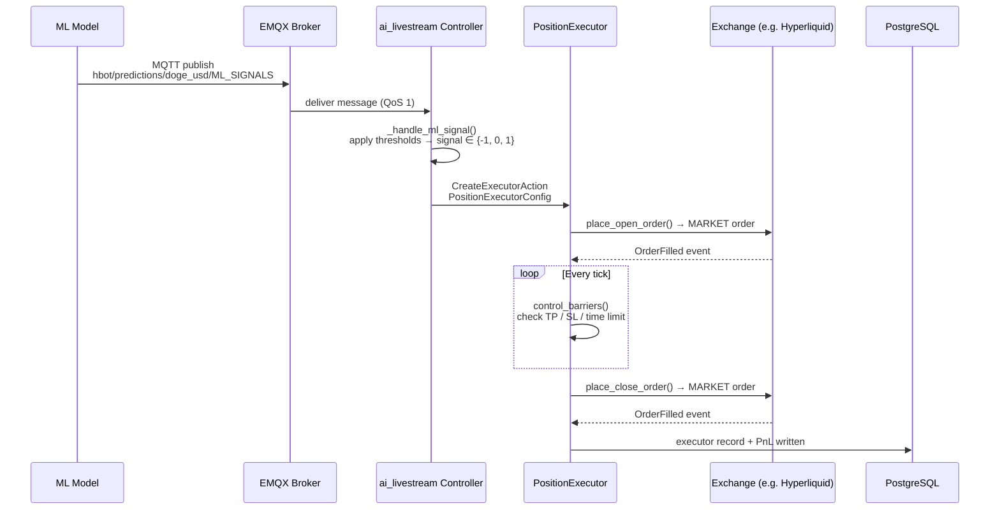

# Signal to Execution: How Hummingbot Executes Positions

This document traces the full lifecycle of a trading signal — from the moment it is published on the MQTT broker to a closed position with PnL stored in the database. It is intended as a reference for the team to understand the execution machinery, debug live trades, and know what to look for in logs.

The stack involves four moving parts:

- **ML model** (Docker container): computes a prediction and publishes a signal to EMQX
- **EMQX broker**: routes the MQTT message to any subscribed bot
- **Hummingbot bot** (Docker container): runs the `ai_livestream` controller, which receives the signal and manages executors
- **PostgreSQL** (via hummingbot-api): stores executor history and PnL



---

## 1. The Signal

The ML model publishes a JSON payload to EMQX on the following topic:

```
hbot/predictions/{normalized_pair}/ML_SIGNALS
```

Where `normalized_pair` is the trading pair lowercased with `-` replaced by `_`. For example, `DOGE-USD` becomes `doge_usd`, yielding:

```
hbot/predictions/doge_usd/ML_SIGNALS
```

Messages are published with **QoS 1** (at least once delivery). `retain` is `False` by default — a bot that connects after the last publish will not see the previous signal until a new one arrives. Set `MQTT_RETAIN_PREDICTIONS=true` in the model's environment to change this.

### Payload schema

```json
{
  "id": 1743580800123,
  "trading_pair": "DOGE-USD",
  "probabilities": [0.12, 0.18, 0.70],
  "timestamp": "2026-04-02T10:00:00.123456",
  "target_pct": 0.018700,
  "short_prob": 0.12,
  "neutral_prob": 0.18,
  "long_prob": 0.70,
  "decision": "long",
  "signal": 1,
  "threshold": {"short": 0.5, "long": 0.5},
  "model_type": "RandomForestClassifier"
}
```

| Field | Type | Description |
|-------|------|-------------|
| `probabilities` | `[float, float, float]` | `[P(short), P(neutral), P(long)]` — **order is critical** |
| `target_pct` | `float` | Rolling volatility estimate (`std(close, 200) / close`, averaged over 100 bars); used to scale TP/SL on the executor |
| `decision` | `string` | Human-readable verdict from the model: `"long"`, `"short"`, or `"neutral"` |
| `signal` | `int` | Integer encoding: `1` = long, `-1` = short, `0` = neutral |
| `threshold` | `object` | Thresholds active in the model at publish time |

> **Note:** The controller reads `probabilities[0]` as short and `probabilities[2]` as long, and applies its own independently-configured thresholds. The `signal` and `decision` fields in the payload are informational only.

### Model log lines

On each successful publish the model prints:

```
Published prediction id=1743580800123 pair=DOGE-USD decision=long signal=1 short=0.120 neutral=0.180 long=0.700 target_pct=0.018700 topic=hbot/predictions/doge_usd/ML_SIGNALS
```

Every `monitoring_log_interval` seconds (default 60s), a heartbeat is also printed:

```
Prediction heartbeat trading_pair=DOGE-USD signal=long signal_age=4.2s decision=long opportunity published (short=0.120, long=0.700, thresholds short>0.500 long>0.500) target_pct=0.0187
```

---

## 2. The Controller Receives It

The bot runs the `ai_livestream` controller, defined in:

```
hummingbot-api/bots/controllers/directional_trading/ai_livestream.py
```

### Subscription setup

When the controller initialises, `_init_ml_signal_listener()` (line 30) subscribes to the signal topic:

```python
normalized_pair = self.config.trading_pair.replace("-", "_").lower()
topic = f"{self.config.topic}/{normalized_pair}/ML_SIGNALS"
self._ml_signal_listener = ExternalTopicFactory.create_async(
    topic=topic,
    callback=self._handle_ml_signal,
    use_bot_prefix=False,
)
```

`ExternalTopicFactory.create_async` registers an async MQTT listener through hummingbot's internal MQTT interface. `use_bot_prefix=False` means the topic is used verbatim — no bot-ID prefix is prepended, which is what allows a single model to feed multiple bots subscribed to the same topic.

**Log on successful startup:**
```
ML signal listener initialized successfully
```

**Log on failure (e.g. broker unreachable at init time):**
```
Failed to initialize ML signal listener: <error message>
```

### Decision logic

Each time a message arrives, `_handle_ml_signal()` (line 45) fires:

```python
def _handle_ml_signal(self, signal: dict, topic: str):
    short, neutral, long = signal["probabilities"]
    if short > self.config.short_threshold:
        self.processed_data["signal"] = -1
    elif long > self.config.long_threshold:
        self.processed_data["signal"] = 1
    else:
        self.processed_data["signal"] = 0
    self.processed_data["features"] = signal
```

The controller applies its own `short_threshold` and `long_threshold` (both default `0.5`). These are marked `is_updatable`, meaning they can be changed via the API while the bot is running without a restart.

| Condition | `processed_data["signal"]` | Meaning |
|-----------|---------------------------|---------|
| `short_prob > short_threshold` | `-1` | Open short |
| `long_prob > long_threshold` | `1` | Open long |
| Neither | `0` | Stay flat |

Note that `short` is evaluated first — if both probabilities exceed their thresholds simultaneously, a short takes precedence.

The full payload is stored in `processed_data["features"]` so downstream components (`get_executor_config`, `to_format_status`) can access `target_pct` and other fields.

> **Tip:** The per-signal log line is commented out in the current code (line 47). To see every incoming payload in the bot log, uncomment:
> ```python
> self.logger().info(f"Received ML signal: {signal}")
> ```

---

## 3. Executor Creation

`processed_data["signal"]` is read on every controller tick by `create_actions_proposal()` in `DirectionalTradingControllerBase` (line 167 of `directional_trading_controller_base.py`):

```python
signal = self.processed_data["signal"]
if signal != 0 and self.can_create_executor(signal):
    price = self.market_data_provider.get_price_by_type(
        self.config.connector_name,
        self.config.trading_pair,
        PriceType.MidPrice,
    )
    amount = self.config.total_amount_quote / price / Decimal(self.config.max_executors_per_side)
    trade_type = TradeType.BUY if signal > 0 else TradeType.SELL
    create_actions.append(CreateExecutorAction(
        controller_id=self.config.id,
        executor_config=self.get_executor_config(trade_type, price, amount),
    ))
```

### Gate: `can_create_executor`

Before creating an executor, two conditions are checked (line 185):

1. **Active executor cap:** The number of currently active executors on the same side must be below `max_executors_per_side` (default: 2).
2. **Cooldown:** At least `cooldown_time` seconds (default: 300) must have elapsed since the last executor on that side closed or was created.

If either condition fails, the signal is silently skipped until the next tick. This prevents the bot from stacking positions on every incoming signal.

### `PositionExecutorConfig`

When both conditions pass, `get_executor_config()` in `ai_livestream.py` (line 60) builds the config:

```python
PositionExecutorConfig(
    timestamp=self.market_data_provider.time(),
    connector_name=self.config.connector_name,   # e.g. "hyperliquid_perpetual"
    trading_pair=self.config.trading_pair,        # e.g. "DOGE-USD"
    side=trade_type,                              # TradeType.BUY or SELL
    entry_price=price,                            # current mid price
    amount=amount,                                # total_amount_quote / price / max_executors_per_side
    triple_barrier_config=self.config.triple_barrier_config.new_instance_with_adjusted_volatility(
        volatility_factor=self.processed_data["features"].get("target_pct", 0.01),
    ),
    leverage=self.config.leverage,
)
```

### `target_pct` scaling

`target_pct` from the signal is passed to `new_instance_with_adjusted_volatility()`, which multiplies the configured `take_profit` and `stop_loss` percentages by this factor:

```
actual_take_profit = config.take_profit × target_pct
actual_stop_loss   = config.stop_loss   × target_pct
```

Example with `take_profit=0.02`, `stop_loss=0.03`, `target_pct=0.0187`:

```
TP = 0.02 × 0.0187 = 0.000374  (~0.037% from entry)
SL = 0.03 × 0.0187 = 0.000561  (~0.056% from entry)
```

This makes exits tighter when the model sees low volatility and wider when it sees high. If `target_pct` is missing from the payload (e.g. malformed message), the executor falls back to `0.01` as a safe default.

---

## 4. Order Placement

Once the executor is created, it enters `RunnableStatus.RUNNING`. On each update tick (every 1 second by default), `control_task()` calls `control_open_order()` (line 394 of `position_executor.py`).

### Entry order

`place_open_order()` (line 439) submits a **market order** to the exchange connector:

```python
order_id = self.place_order(
    connector_name=self.config.connector_name,
    trading_pair=self.config.trading_pair,
    order_type=OrderType.MARKET,        # always MARKET for directional entries
    amount=self.config.amount,
    price=self.entry_price,
    side=self.config.side,              # BUY or SELL
    position_action=PositionAction.OPEN,
)
self._open_order = TrackedOrder(order_id=order_id)
```

**Log to expect (debug level):**
```
Executor ID: <uuid> - Placing open order <order_id>
```

### Order event tracking

As the connector fires events, the executor updates its internal state:

| Event | Handler | Effect |
|-------|---------|--------|
| `BuyOrderCreatedEvent` / `SellOrderCreatedEvent` | `process_order_created_event` | Links the exchange order ID to `_open_order` |
| `OrderFilledEvent` | `process_order_filled_event` | Updates filled amounts on `_open_order` |
| `BuyOrderCompletedEvent` / `SellOrderCompletedEvent` | `process_order_completed_event` | Marks `_open_order.is_done = True` |

Once `_open_order.is_filled` is `True`, `open_filled_amount > 0`, and the position size exceeds both `min_order_size` and `min_notional_size` from the connector's trading rules, the executor transitions to barrier monitoring on the next tick.

**Log on order failure (retries up to `max_retries`, default 10):**
```
Open order failed <order_id>. Retrying <n>/10
```

---

## 5. Position Monitoring

After the entry fill, `control_barriers()` (line 457) runs on every tick:

```python
def control_barriers(self):
    if self._open_order.is_filled
            and open_filled_amount >= min_order_size
            and open_filled_amount_quote >= min_notional_size:
        self.control_stop_loss()
        if self.status == RunnableStatus.RUNNING:
            self.control_trailing_stop()
            self.control_take_profit()
    self.control_time_limit()   # always checked, even before the fill
```

### Stop loss (line 510)

Checks `net_pnl_pct` (unrealised PnL as a fraction of position value) on every tick:

```python
if self.net_pnl_pct <= -self.config.triple_barrier_config.stop_loss:
    self.place_close_order_and_cancel_open_orders(close_type=CloseType.STOP_LOSS)
```

Uses a market close order. Evaluated before TP, so a large adverse move that crosses both barriers exits as `STOP_LOSS`.

### Take profit (line 521)

Two modes depending on `take_profit_order_type`:

- **`LIMIT`** (default for `ai_livestream`): places a resting limit order at `take_profit_price` once the price is within activation bounds. Cancels and replaces if partially filled. When the limit order fills, `close_type` is set to `TAKE_PROFIT` and the executor begins shutting down.
- **`MARKET`**: triggered when `net_pnl_pct >= take_profit`, places a market close order immediately.

**Log when TP limit order is placed (debug):**
```
Executor ID: <uuid> - Placing take profit order <order_id>
```

**Log when TP limit order is renewed due to partial fill (debug):**
```
Renewing take profit order
```

### Time limit (line 545)

```python
if self.is_expired:
    self.place_close_order_and_cancel_open_orders(close_type=CloseType.TIME_LIMIT)
```

`is_expired` is `True` when `current_timestamp − config.timestamp > time_limit` (default 2700 seconds / 45 minutes). This barrier is checked on every tick regardless of fill status — an executor that never fills will expire and stop cleanly. Uses a market close order.

### Close type reference

| `CloseType` | Trigger |
|-------------|---------|
| `TAKE_PROFIT` | TP barrier hit (limit filled or market triggered) |
| `STOP_LOSS` | SL barrier hit |
| `TIME_LIMIT` | Position held past the time limit |
| `EARLY_STOP` | Manual stop via API (`POST /executors/{id}/stop`) |
| `EXPIRED` | Executor created after its own `timestamp + time_limit` had already passed |
| `POSITION_HOLD` | Stopped with `keep_position=True`; open fill is kept as a held position |
| `FAILED` | Max retries exceeded while trying to place/fill orders |

Once a barrier triggers, the executor transitions to `RunnableStatus.SHUTTING_DOWN`.
