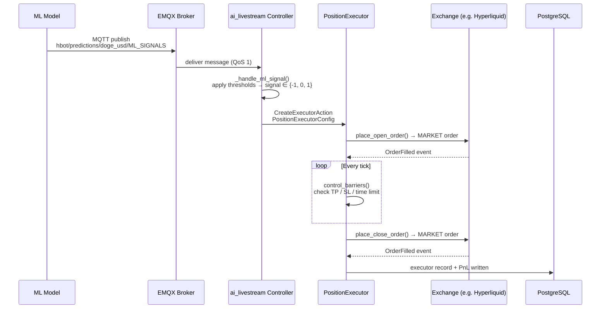

# Signal to Execution: How Hummingbot Executes Positions

This document traces the full lifecycle of a trading signal — from the moment it is published on the MQTT broker to a closed position with PnL stored in the database. It is intended as a reference for the team to understand the execution machinery, debug live trades, and know what to look for in logs.

The stack involves four moving parts:

- **ML model** (Docker container): computes a prediction and publishes a signal to EMQX
- **EMQX broker**: routes the MQTT message to any subscribed bot
- **Hummingbot bot** (Docker container): runs the `ai_livestream` controller, which receives the signal and manages executors
- **PostgreSQL** (via hummingbot-api): stores executor history and PnL



---

## 1. The Signal

The ML model publishes a JSON payload to EMQX on the following topic:

```
hbot/predictions/{normalized_pair}/ML_SIGNALS
```

Where `normalized_pair` is the trading pair lowercased with `-` replaced by `_`. For example, `DOGE-USD` becomes `doge_usd`, yielding:

```
hbot/predictions/doge_usd/ML_SIGNALS
```

Messages are published with **QoS 1** (at least once delivery). `retain` is `False` by default — a bot that connects after the last publish will not see the previous signal until a new one arrives. Set `MQTT_RETAIN_PREDICTIONS=true` in the model's environment to change this.

### Payload schema

```json
{
  "id": 1743580800123,
  "trading_pair": "DOGE-USD",
  "probabilities": [0.12, 0.18, 0.70],
  "timestamp": "2026-04-02T10:00:00.123456",
  "target_pct": 0.018700,
  "short_prob": 0.12,
  "neutral_prob": 0.18,
  "long_prob": 0.70,
  "decision": "long",
  "signal": 1,
  "threshold": {"short": 0.5, "long": 0.5},
  "model_type": "RandomForestClassifier"
}
```

| Field | Type | Description |
|-------|------|-------------|
| `probabilities` | `[float, float, float]` | `[P(short), P(neutral), P(long)]` — **order is critical** |
| `target_pct` | `float` | Rolling volatility estimate (`std(close, 200) / close`, averaged over 100 bars); used to scale TP/SL on the executor |
| `decision` | `string` | Human-readable verdict from the model: `"long"`, `"short"`, or `"neutral"` |
| `signal` | `int` | Integer encoding: `1` = long, `-1` = short, `0` = neutral |
| `threshold` | `object` | Thresholds active in the model at publish time |

> **Note:** The controller reads `probabilities[0]` as short and `probabilities[2]` as long, and applies its own independently-configured thresholds. The `signal` and `decision` fields in the payload are informational only.

### Model log lines

On each successful publish the model prints:

```
Published prediction id=1743580800123 pair=DOGE-USD decision=long signal=1 short=0.120 neutral=0.180 long=0.700 target_pct=0.018700 topic=hbot/predictions/doge_usd/ML_SIGNALS
```

Every `monitoring_log_interval` seconds (default 60s), a heartbeat is also printed:

```
Prediction heartbeat trading_pair=DOGE-USD signal=long signal_age=4.2s decision=long opportunity published (short=0.120, long=0.700, thresholds short>0.500 long>0.500) target_pct=0.0187
```
