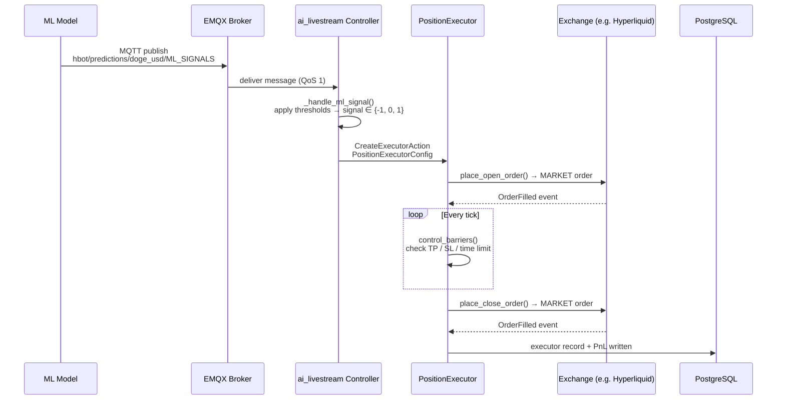

# Signal to Execution: How Hummingbot Executes Positions

This document traces the full lifecycle of a trading signal — from the moment it is published on the MQTT broker to a closed position with PnL stored in the database. It is intended as a reference for the team to understand the execution machinery, debug live trades, and know what to look for in logs.

The stack involves four moving parts:

- **ML model** (Docker container): computes a prediction and publishes a signal to EMQX
- **EMQX broker**: routes the MQTT message to any subscribed bot
- **Hummingbot bot** (Docker container): runs the `ai_livestream` controller, which receives the signal and manages executors
- **PostgreSQL** (via hummingbot-api): stores executor history and PnL

