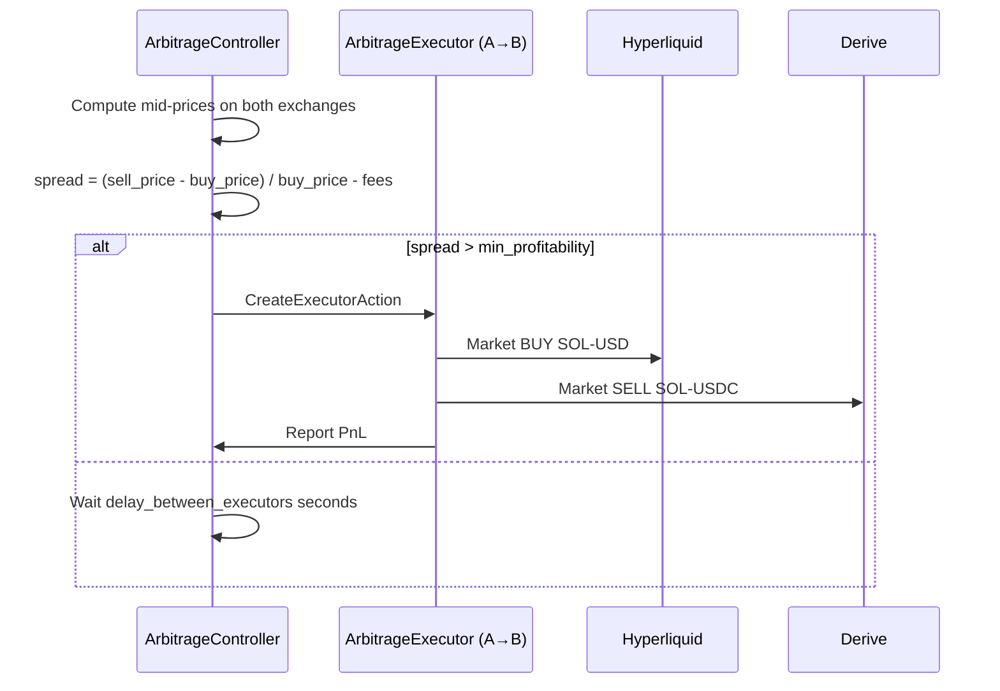

# SOL Arbitrage: Hyperliquid ↔ Derive

This guide walks you through deploying an automated SOL arbitrage bot between Hyperliquid and Derive using hummingbot-api. Two strategies are covered: **spot-spot arbitrage** (simpler, lower risk) and **funding rate arbitrage** (perpetuals, earns funding payments). Both strategies exploit price and rate discrepancies between the two exchanges with simultaneous opposing positions.

---

## Table of Contents

1. [Architecture Overview](#1-architecture-overview)
2. [Prerequisites](#2-prerequisites)
3. [Configure Exchange Credentials](#3-configure-exchange-credentials)
4. [Choose a Strategy](#4-choose-a-strategy)
   - [Option A — Spot Arbitrage (arbitrage_controller)](#option-a--spot-arbitrage-arbitrage_controller)
   - [Option B — Funding Rate Arbitrage (perp-perp)](#option-b--funding-rate-arbitrage-perp-perp)
5. [Create the Controller Config](#5-create-the-controller-config)
6. [Deploy the Bot](#6-deploy-the-bot)
7. [Monitor & Manage](#7-monitor--manage)
8. [Stop & Archive](#8-stop--archive)
9. [Parameter Reference](#9-parameter-reference)
10. [Tips & Common Issues](#10-tips--common-issues)

---

## 1. Architecture Overview

```
┌─────────────────────────────────────────────────────────────────┐
│                        hummingbot-api                           │
│                                                                 │
│  POST /controllers/configs/  ──► YAML config stored            │
│  POST /bot-orchestration/deploy-v2-controllers                  │
│         │                                                       │
│         ▼                                                       │
│  Docker container spawned with v2_with_controllers.py           │
│         │                                                       │
│         ▼                                                       │
│  ArbitrageController (generic)                                  │
│    ├── ArbitrageExecutor (buy on A, sell on B)                  │
│    └── ArbitrageExecutor (buy on B, sell on A)                  │
└─────────────────────────────────────────────────────────────────┘
          │                             │
          ▼                             ▼
  ┌───────────────┐           ┌─────────────────┐
  │  Hyperliquid  │           │     Derive       │
  │  SOL-USD      │           │  SOL-USDC (spot) │
  │  SOL-USD perp │           │  SOL-USD  (perp) │
  └───────────────┘           └─────────────────┘
```

**How arbitrage works:**



The controller simultaneously watches both directions (buy HL / sell Derive, and buy Derive / sell HL) and fires when the spread exceeds `min_profitability` after fees.

---

## 2. Prerequisites

| Requirement | Details |
|---|---|
| hummingbot-api running | `https://api.metallorum.duckdns.org/` |
| Hyperliquid account | Wallet address + private key |
| Derive account | Wallet address + private key |
| Funded wallets | SOL + USD on Hyperliquid; SOL + USDC on Derive |
| `master_account` credentials | API account already set up in hummingbot-api |

Verify the API is reachable and your account exists:

```bash
# Check available accounts
curl -u admin:YOUR_PASSWORD \
  https://api.metallorum.duckdns.org/accounts/

# Expected output: ["master_account", ...]
```

---

## 3. Configure Exchange Credentials

You need credentials for both connectors stored in the same account profile. Skip any connector that's already configured.

### 3.1 Check existing credentials

```bash
curl -u admin:YOUR_PASSWORD \
  https://api.metallorum.duckdns.org/accounts/master_account/credentials
```

Look for `hyperliquid` and `derive` (spot) or `hyperliquid_perpetual` and `derive_perpetual` (for funding rate arb) in the response.

### 3.2 Add Hyperliquid spot credentials

```bash
curl -u admin:YOUR_PASSWORD \
  -X POST \
  -H "Content-Type: application/json" \
  -d '{
    "hyperliquid_api_key": "0xYOUR_WALLET_ADDRESS",
    "hyperliquid_secret_key": "0xYOUR_PRIVATE_KEY"
  }' \
  https://api.metallorum.duckdns.org/accounts/add-credential/master_account/hyperliquid
```

### 3.3 Add Derive spot credentials

```bash
curl -u admin:YOUR_PASSWORD \
  -X POST \
  -H "Content-Type: application/json" \
  -d '{
    "derive_api_key": "0xYOUR_WALLET_ADDRESS",
    "derive_secret_key": "0xYOUR_PRIVATE_KEY"
  }' \
  https://api.metallorum.duckdns.org/accounts/add-credential/master_account/derive
```

> **Note for perpetual connectors:** Use `hyperliquid_perpetual` and `derive_perpetual` as the connector names in the credential endpoints when deploying the funding rate arbitrage variant.

---

## 4. Choose a Strategy

### Option A — Spot Arbitrage (`arbitrage_controller`)

**Best for:** Lower risk, market-neutral, no leverage required.

The bot monitors the SOL spot price on both exchanges in real time. When the price difference exceeds `min_profitability` (after fees), it simultaneously buys on the cheaper exchange and sells on the more expensive one. Capital is returned after each trade cycle.

| Exchange | Connector | Trading Pair | Role |
|---|---|---|---|
| Hyperliquid | `hyperliquid` | `SOL-USD` | Leg 1 |
| Derive | `derive` | `SOL-USDC` | Leg 2 |

**Expected profit per trade:** 0.2–0.5% gross, minus ~0.05–0.1% fees per side.

**Capital required:** ~2× position size (funds locked on both sides per executor).

---

### Option B — Funding Rate Arbitrage (perp-perp)

**Best for:** Capturing sustained funding rate differentials between the two exchanges.

The bot opens opposing perpetual positions (long on the exchange paying funding, short on the one receiving it) and collects the net funding payment over time. Position PnL is approximately delta-neutral.

| Exchange | Connector | Trading Pair | Position |
|---|---|---|---|
| Hyperliquid | `hyperliquid_perpetual` | `SOL-USD` | Long or Short |
| Derive | `derive_perpetual` | `SOL-USD` | Opposite |

**Funding intervals:** Hyperliquid pays every **1 hour**; Derive pays every **8 hours**.

**Key risk:** Funding rates can flip — the bot will stop the position if the rate differential inverts past `funding_rate_diff_stop_loss`.

> This strategy uses the `v2_funding_rate_arb.py` script (not the controller framework). See [Option B deployment steps](#option-b-funding-rate-arb-deployment) below.

---

## 5. Create the Controller Config

### Option A — Spot Arbitrage Config

Create the controller config YAML via the API:

```bash
curl -u admin:YOUR_PASSWORD \
  -X POST \
  -H "Content-Type: application/json" \
  -d '{
    "content": "controller_name: arbitrage_controller\ncontroller_type: generic\nid: sol_arb_hl_derive\nexchange_pair_1:\n  connector_name: hyperliquid\n  trading_pair: SOL-USD\nexchange_pair_2:\n  connector_name: derive\n  trading_pair: SOL-USDC\nmin_profitability: 0.002\ntotal_amount_quote: 100\ndelay_between_executors: 10\nmax_executors_imbalance: 1\nrate_connector: kucoin\nquote_conversion_asset: USDT\n"
  }' \
  https://api.metallorum.duckdns.org/controllers/configs/sol_arb_hl_derive
```

Equivalent YAML content:

```yaml
# bots/conf/controllers/sol_arb_hl_derive.yml
controller_name: arbitrage_controller
controller_type: generic
id: sol_arb_hl_derive

# Leg 1: Hyperliquid spot
exchange_pair_1:
  connector_name: hyperliquid
  trading_pair: SOL-USD

# Leg 2: Derive spot
exchange_pair_2:
  connector_name: derive
  trading_pair: SOL-USDC

# Strategy parameters
min_profitability: 0.002         # 0.2% minimum spread after fees to trigger
total_amount_quote: 100          # Position size in USD equivalent per executor
delay_between_executors: 10      # Seconds to wait between new executors
max_executors_imbalance: 1       # Max difference between buy-A and buy-B executors

# Rate oracle for USD/USDC cross-rate
rate_connector: kucoin
quote_conversion_asset: USDT
```

**Parameter tuning guide:**

| Parameter | Conservative | Balanced | Aggressive |
|---|---|---|---|
| `min_profitability` | `0.004` (0.4%) | `0.002` (0.2%) | `0.001` (0.1%) |
| `total_amount_quote` | `50` | `100` | `500` |
| `delay_between_executors` | `30` | `10` | `5` |

Set `min_profitability` above your combined fee cost (~0.1% total). Lower values increase trade frequency but risk negative-PnL fills.

---

### Option B — Funding Rate Arb Config

The `v2_funding_rate_arb.py` script accepts a YAML config. Create it:

```yaml
# bots/conf/scripts/sol_funding_rate_arb.yml
script_file_name: v2_funding_rate_arb.py

leverage: 5                              # Leverage on each perp position (keep low, 3–10x)
min_funding_rate_profitability: 0.001    # Min daily funding diff to enter (0.1%)
connectors:
  - hyperliquid_perpetual
  - derive_perpetual
tokens:
  - SOL
position_size_quote: 200                 # Size of each leg in USD
profitability_to_take_profit: 0.01       # Close position at 1% total PnL
funding_rate_diff_stop_loss: -0.001      # Stop if funding diff inverts past -0.1%
trade_profitability_condition_to_enter: false
```

> **Important:** The `v2_funding_rate_arb.py` script's `quote_markets_map` hardcodes `hyperliquid_perpetual → USD` and `binance_perpetual → USDT`. Since **Derive perpetual also uses USD**, you must ensure the trading pair resolves correctly. The script falls back to `USDT` for unknown connectors. If `SOL-USDT` doesn't exist on Derive, the connector will fail.
>
> **Workaround:** Copy `v2_funding_rate_arb.py` to `bots/scripts/` in hummingbot-api and add `"derive_perpetual": "USD"` to the `quote_markets_map` dict. The shared scripts volume will make it available to all bot instances.

---

## 6. Deploy the Bot

### Option A — Spot Arb Deployment

```bash
curl -u admin:YOUR_PASSWORD \
  -X POST \
  -H "Content-Type: application/json" \
  -d '{
    "instance_name": "sol-arb-hl-derive",
    "credentials_profile": "master_account",
    "controllers_config": ["sol_arb_hl_derive"],
    "max_global_drawdown_quote": 50,
    "max_controller_drawdown_quote": 50,
    "image": "hummingbot/hummingbot:latest",
    "headless": true
  }' \
  https://api.metallorum.duckdns.org/bot-orchestration/deploy-v2-controllers
```

**Response:**

```json
{
  "success": true,
  "unique_instance_name": "sol-arb-hl-derive-20260331-143000",
  "message": "Bot deployed successfully"
}
```

Save the `unique_instance_name` — you'll need it for monitoring and stopping.

**What happens behind the scenes:**
1. hummingbot-api creates `bots/instances/sol-arb-hl-derive-20260331-143000/`
2. Copies credentials from `master_account` into the instance
3. Copies `sol_arb_hl_derive.yml` and generates a script config
4. Spawns a Docker container running `v2_with_controllers.py` in headless mode
5. The controller begins watching both order books immediately

---

### Option B — Funding Rate Arb Deployment

The funding rate arb uses a standalone script. You need to spin up a hummingbot instance first, then start the script:

**Step 1:** Deploy a bare hummingbot instance via docker (no controller config):

```bash
# Start a hummingbot container manually via the docker endpoint
curl -u admin:YOUR_PASSWORD \
  -X POST \
  -H "Content-Type: application/json" \
  -d '{
    "instance_name": "sol-funding-arb",
    "credentials_profile": "master_account",
    "image": "hummingbot/hummingbot:latest",
    "headless": false
  }' \
  https://api.metallorum.duckdns.org/bot-orchestration/deploy-v2-controllers
```

**Step 2:** Start the funding rate arb script on the running instance:

```bash
curl -u admin:YOUR_PASSWORD \
  -X POST \
  -H "Content-Type: application/json" \
  -d '{
    "bot_name": "sol-funding-arb-20260331-143000",
    "script": "v2_funding_rate_arb",
    "conf": "sol_funding_rate_arb",
    "log_level": "INFO"
  }' \
  https://api.metallorum.duckdns.org/bot-orchestration/start-bot
```

---

## 7. Monitor & Manage

### Check bot status

```bash
curl -u admin:YOUR_PASSWORD \
  https://api.metallorum.duckdns.org/bot-orchestration/sol-arb-hl-derive-20260331-143000/status
```

The response includes:
- `performance`: realized PnL, volume traded, open executors
- `general_logs`: recent log lines
- `error_logs`: any errors

### View all running bots

```bash
curl -u admin:YOUR_PASSWORD \
  https://api.metallorum.duckdns.org/bot-orchestration/status
```

### Fetch trading history

```bash
curl -u admin:YOUR_PASSWORD \
  "https://api.metallorum.duckdns.org/bot-orchestration/sol-arb-hl-derive-20260331-143000/history?days=1&verbose=true"
```

### What to watch for

| Signal | Meaning | Action |
|---|---|---|
| Executors firing frequently | Spread is available | Good — verify PnL is positive |
| Zero executors for >30 min | Spread below `min_profitability` | Normal — consider lowering threshold |
| Error logs: "balance" | Insufficient funds on one exchange | Top up wallet |
| Error logs: "order not found" | Partial fill or race condition | Bot handles automatically |
| High imbalance (buy-only or sell-only) | One leg consistently cheaper | Normal during trends — resolves when spread closes |

---

## 8. Stop & Archive

### Graceful stop (cancels open orders)

```bash
curl -u admin:YOUR_PASSWORD \
  -X POST \
  -H "Content-Type: application/json" \
  -d '{
    "bot_name": "sol-arb-hl-derive-20260331-143000",
    "skip_order_cancellation": false
  }' \
  https://api.metallorum.duckdns.org/bot-orchestration/stop-bot
```

### Stop and archive (removes instance files)

```bash
curl -u admin:YOUR_PASSWORD \
  -X POST \
  https://api.metallorum.duckdns.org/bot-orchestration/stop-and-archive-bot/sol-arb-hl-derive-20260331-143000
```

---

## 9. Parameter Reference

### `arbitrage_controller` (spot arb)

| Parameter | Type | Default | Description |
|---|---|---|---|
| `exchange_pair_1` | ConnectorPair | — | First exchange + trading pair |
| `exchange_pair_2` | ConnectorPair | — | Second exchange + trading pair |
| `min_profitability` | Decimal | `0.01` | Minimum net spread to trigger (after fees) |
| `total_amount_quote` | Decimal | — | Position size per executor in quote currency |
| `delay_between_executors` | int | `10` | Cooldown (seconds) after each completed executor |
| `max_executors_imbalance` | int | `1` | Max allowed difference between buy-A and buy-B executors |
| `rate_connector` | str | `binance` | Exchange used for cross-rate quotes |
| `quote_conversion_asset` | str | `USDT` | Common quote for cross-rate calculation |

### `v2_funding_rate_arb` (perp arb)

| Parameter | Type | Default | Description |
|---|---|---|---|
| `leverage` | int | `20` | Leverage applied on each perpetual position |
| `min_funding_rate_profitability` | Decimal | `0.001` | Min expected daily funding diff to open position |
| `connectors` | Set[str] | — | Perpetual connectors (e.g., `hyperliquid_perpetual,derive_perpetual`) |
| `tokens` | Set[str] | — | Base tokens to arb (e.g., `SOL`) |
| `position_size_quote` | Decimal | `100` | Size of each leg in USD |
| `profitability_to_take_profit` | Decimal | `0.01` | Close position when total PnL reaches this |
| `funding_rate_diff_stop_loss` | Decimal | `-0.001` | Close position if daily funding diff inverts past this |
| `trade_profitability_condition_to_enter` | bool | `False` | Also require positive trade PnL to enter |

### Exchange connector names

| Exchange | Spot Connector | Perp Connector | SOL Trading Pair (spot) | SOL Trading Pair (perp) |
|---|---|---|---|---|
| Hyperliquid | `hyperliquid` | `hyperliquid_perpetual` | `SOL-USD` | `SOL-USD` |
| Derive | `derive` | `derive_perpetual` | `SOL-USDC` | `SOL-USD` |

---

## 10. Tips & Common Issues

**Before going live:**

- [ ] Verify both wallets are funded (SOL + quote asset on each exchange)
- [ ] Run with `total_amount_quote: 10` for a few hours first to validate execution
- [ ] Check that both connectors appear in your account credentials
- [ ] Confirm SOL-USD and SOL-USDC markets are active on both exchanges
- [ ] Set `max_global_drawdown_quote` to cap losses (suggested: 20–50% of capital)

**Common issues:**

**Bot deploys but no trades:**
- Spread is below `min_profitability`. Lower to `0.001` temporarily to test execution, then set your real threshold.
- Check logs for rate oracle errors (`Cannot get conversion rate for SOL-USDT`). This means `rate_connector: kucoin` can't fetch the pair — verify kucoin credentials are present.

**"Insufficient balance" errors:**
- The arbitrage executor needs funds on BOTH legs simultaneously. Each executor locks ~`total_amount_quote` USD on each side.
- Minimum recommended: 3–5× `total_amount_quote` per exchange to handle concurrent executors.

**Orders get stuck / not filled:**
- Both legs use `OrderType.MARKET` — fills should be immediate. If you see stuck executors, check exchange connectivity.

**Funding rate arb: derive_perpetual uses USDT pair:**
- Symptom: "trading pair SOL-USDT does not exist on derive_perpetual"
- Fix: Add `"derive_perpetual": "USD"` to `quote_markets_map` in your custom copy of `v2_funding_rate_arb.py`.

**One exchange consistently cheaper:**
- This is normal during trending markets. The bot correctly keeps firing in one direction. The `max_executors_imbalance` parameter prevents runaway capital concentration — keep it at `1` or `2`.

**Monitoring funding rate profitability before entry:**

You can check current funding rates without running the bot:

```bash
# Get funding rate info from market data endpoint
curl -u admin:YOUR_PASSWORD \
  "https://api.metallorum.duckdns.org/market-data/funding-rates?connector=hyperliquid_perpetual&trading_pair=SOL-USD"

curl -u admin:YOUR_PASSWORD \
  "https://api.metallorum.duckdns.org/market-data/funding-rates?connector=derive_perpetual&trading_pair=SOL-USD"
```

A daily funding differential of >0.1% (annualized ~36%) is typically worth entering. Below 0.05% daily, fees may eat the profit.
